## Table of Contents

- [Introduction](docs/introduction.md)

  - [Enterprise Application Integration](docs/introduction.md#enterprise-application-integration)
  - [Message Brokers](docs/introduction.md#message-brokers)

- [Architecture](docs/architecture.md)

  - [Integration Patterns](docs/architecture.md#integration-patterns)
  - [Scalability and Clustering](docs/architecture.md#scalability-and-clustering)


# Integration Nodes and servers

There is no option to create the node from the toolkit. You can run

```
mqsicreatebroker ACE12NODE (*optional* -i ace12user -a ace12user) -q QMGR
```

The integration node is represented by the node.conf.yaml that can be
overriden by a node.conf.yaml in the overrides directory. If you use
commands to modify the integration node, the changes are saved in the
integration node's override node.conf.yaml file.
Within the node.conf.yaml you can set the administration REST API port
for the ACE web user interface and the ACE Toolkit, specify the host,
enable authentication, enable administration security and specify an
authorization mode. You can also modify properties to enable the
integration node listener, to configure the MQTT server, and to specify
a default queue manager.

```
      RestAdminListener:
        port: 4414   # Set the Admin REST API Port for ACE Web UI and Toolkit. Defaults to 4414

  # Note the Admin REST API will be insecure without the following being set
        host: 'localhost'  # Set the hostname otherwise we bind to the unspecified address
        basicAuth: true
        adminSecurity: active 
        authMode: file
      NodeHttpListener:
        startListener: true                   # Enables the Integration Node listener
        HTTPConnector:
          ListenerPort: 7080           # Set non-zero to set a specific port, defaults to 7080
      MQTTServer:
          #enabled: true                            # Enables the MQTT server
          #port: 11883                              # Sets the port for the MQTT server

      defaultQueueManager: 'AMITQMGR'     # Set non-empty string to specify a default queue manager
```

When you create integration servers that are owned by the integration
node, a default server.conf.yaml configuration file is created for each
of the integration servers, and they are stored in the file system in
subdirectories below the integration node directory. Any properties that
you set for the integration node, in the node.conf.yaml file, are
inherited by the integration servers that it owns. If you have a message
flow that contains an MQEndpoint policy that connects to queue manager
ACEQM & you deploy it to an independent Integration Server (without a
queue manager specified in it's server.conf.yaml) you will see the
message:

> BIP1361E Message flow node 'MQ Input',
> 'com.udemy.ace12_26.MQEndpointTest#FCMComposite_1_1' in Message flow
> 'com.udemy.ace12_26.MQEndpointTest',
> 'com.udemy.ace12_26.MQEndpointTest' requires Policy 'Default' of
> type 'MQEndpoint' which is not deployed.

If you deploy with a QMGR in the server.conf.yaml then deployment
completes without problems. If you stop the IServer, remove the
defaultQueueManager from the conf file, then try to start it again you
will see:

> BIP1361E Message flow node 'MQ Input',
> 'com.udemy.ace12_26.MQEndpointTest#FCMComposite_1_1' in Message flow
> 'com.udemy.ace12_26.MQEndpointTest',
> 'com.udemy.ace12_26.MQEndpointTest' requires Policy 'Default' of
> type 'MQEndpoint' which is not deployed. The identified resource
> requires a policy which has not been deployed. If this message is
> reported while the message flow is being deployed then this will not
> cause the deploy operation to fail however the message flow will be
> unable to start until the missing policy is deployed. Deploy the
> missing policy, or update the message flow to remove the dependancy on
> the policy.

When you create a managed integration server for an integration node,
server-specific settings are created for it in its own server.conf.yaml
file. The server-specific file is located at:
$MQSI_WORKPATH/components/"Node name"/servers/"Node owned Server
name"/server.conf.yaml.

However, you can change any of the integration server properties
by modifying them in the appropriate server.conf.yaml file. For more
information about configuring integration servers that are managed by an
integration node, see Configuring an integration server by modifying the
server.conf.yaml file.
The location of the server.conf.yaml file that you need to modify
depends on whether you are configuring an independent integration server
or an integration server that is managed by an integration node.

Modify the properties that you want to change in the file. For example:
In the RestAdminListener section, set a value for the Port property to
be used by the REST administration port, which is the primary method of
communicating with the integration server. (Default value of 7600.) In
the ResourceManagers / HTTPConnector section, set a value for the
ListenerPort so that you can send messages to a flow that is using a
HTTPInput node. (Default value of 7800.) In the ResourceManagers / JVM
section, set a value for the jvmDebugPort so that you can use the Flow
Debugger. For example, set this property to 9997.

```
    RestAdminListener:
      port: 7600

      ResourceManagers:
      HTTPConnector:
        ListenerPort: 7800
      JVM:
        jvmDebugPort: 9997
```

# Message Transformation

Application A produces XML format, but Application B accepts JSON

A -XML-> ESB -JSON-> B

Formats include XML, JSON, SOAP, CSV, TAG delimited.

# Transformation using XSL in a message flow

Use the XSLTransform node to transform an XML message to another form
of message, according to the rules provided by an XSL (Extensible
Stylesheet Language) style sheet, and to set the Message domain, Message
model, Message, and Physical format for the generated message.

Here is a sample XSL file. You can drag and drop the file onto the
Application in your toolkit. Then your XSL Transform node can reference
it in it's properties.

```
    <xsl:stylesheet version="1.0" xmlns:xsl="http://www.w3.org/1999/XSL/Transform"> 
    <xsl:output method="xml" indent="yes"/> 
     <xsl:template match="/"> 
      <xsl:element name="PrimeCustomer"> 
       <xsl:for-each select="shoppingCart/Customer">
         <xsl:element name="customer">
           <xsl:element name="ID"><xsl:value-of select="@ID"/></xsl:element>
           <xsl:element name="Amount"><xsl:value-of select="amount"/></xsl:element>
           <xsl:element name="paymentType"><xsl:value-of select="paymentType"/></xsl:element>
        </xsl:element>
       </xsl:for-each>
      </xsl:element>
     </xsl:template> 
    </xsl:stylesheet>
```

XSLT uses XPath to define parts of the source document that should
match one or more predefined templates. The value of the match attribute
of the <xsl:template> instruction must be a match pattern. / in XPath
denotes the root or document node. When a match is found, XSLT will
transform the matching part of the source document into the result
document.

#### Source

```
  <shoppingCart>
    <Customer ID="434">
    <amount>5600</amount>
    <paymentType>netbanking</paymentType>
    </Customer>
    <Customer ID="435">
    <amount>4580</amount>
    <paymentType>card</paymentType>
    </Customer>
    <Customer ID="436">
    <amount>2000</amount>
    <paymentType>netbanking</paymentType>
    </Customer>
    <Customer ID="437">
    <amount>5000</amount>
    <paymentType>card</paymentType>
    </Customer>
</shoppingCart>
```

#### Target

```
        <PrimeCustomer>
        <customer>
           <ID>434</ID>
           <Amount>5600</Amount>
           <paymentType>netbanking</paymentType>
        </customer>
        <customer>
           <ID>435</ID>
           <Amount>4580</Amount>
           <paymentType>card</paymentType>
        </customer>
        <customer>
           <ID>436</ID>
           <Amount>2000</Amount>
           <paymentType>netbanking</paymentType>
        </customer>
        <customer>
           <ID>437</ID>
           <Amount>5000</Amount>
           <paymentType>card</paymentType>
        </customer>
     </PrimeCustomer>
```

As of August 2022, the most recent stable version of the language
is XSLT 3.0. The correct way to declare an XSL style sheet according to
the W3C XSLT Recommendation is:

```
<xsl:stylesheet version="1.0"\
xmlns:xsl="http://www.w3.org/1999/XSL/Transform">
```

The "xmlns:xsl="http://www.w3.org/1999/XSL/Transform" points to
the official W3C XSLT namespace. If you use this namespace, you must
also include the attribute version="1.0".

# Message Routing

Application A -XML-> ESB -> B (XML)

Application A -JSON-> ESB -> C (JSON)


Suppose you have a Route node preceding the RCD node. Within it you can
set XPaths. These are used to extract the header information. In the
Postman request you can set the content type to XML or JSON. Then the
XPath dictates which node to propagate to. It might send the message to
the RCD where the domain is set.

## Filter node

Use the Filter node with an ESQL statement to determine the next node
to which the message is sent by this node. Do not use the ESQL code that
you develop for use in a Filter node in any other type of node.

## RouteToLabel node

Use the RouteToLabel node after a Compute node or a JavaCompute node
for complex routing. Define a list of destinations in a Compute or
JavaCompute node that are acted on by the RouteToLabel node. The
RouteToLabel node interrogates the destinations and passes the message
on to the corresponding Label node.

# Message Enrichment

Application A -Hi-> ESB (adds 'how are you?') -> B (Hi how are
you?)

# Protocol conversion (MQ, File, http, SOAP, SMTP, POP3, JMS, SFTP)

[Application A -HTTP-> ESB (HTTP to FTP) -> B (FTP)]

# SOA (Service Oriented Architecture)

Reusable service, loosely coupled, independent SOAP API based on XML.
REST API based on JSON

# Toolkit

IIB only needs MQ if you are using MQ nodes. Before IIB v9 it was
called WMB where MQ is a prerequisite. The QMGR contains Integration
Node configuration. IIB v10 MQ is not a prerequisite. Right click on the
Application -> New message flow name LargeMessages

# Application vs Integration Project

Both are a Container, but the Application provide isolation since you
can use the resources it contains. This is needed for Microservices
where the MS is contained.

# ESQL native to IIB

Before you create your ESQL message flow you package it into a schema.
An example schema is com.test.tran. This concept is akin to JAVA
packages. An Integration Project's resources are reusable, but an
Application's resources are contained and hence isolated.

```
CREATE COMPUTE MODULE XMLToJsonMsgFlow_Compute
```

"CREATE MODULE" creates a module, which is a named container
associated with a node. Modules, functions & procedures contained by a
schema must all have unique names.
Modules for the Compute node, database node & filter node must all contain exactly 1 function called Main. This function should return a Boolean. Main is the entry point used by a message flow node when processing a message.

```
CREATE COMPUTE MODULE FileNode1_Compute
       CREATE FUNCTION Main() RETURNS BOOLEAN
       BEGIN

            -- CALL CopyMessageHeaders(); // This will only copy the Properties & MQMD. NOT the XMLNSC as I < J.
            -- CALL CopyEntireMessage();
            RETURN TRUE;

       END;

      CREATE PROCEDURE CopyMessageHeaders() 
      BEGIN
            DECLARE I INTEGER 1;
            DECLARE J INTEGER CARDINALITY(InputRoot.*[]);
            WHILE I < J DO
              SET OutputRoot.*[I] = InputRoot.*[I];
              SET I = I + 1;

            END WHILE;
      END;
END MODULE;
```


The __COALESCE__ function evaluates its parameters in
order and returns the first one that is not NULL.

CARDINALITY returns the number of elements in a list; here the
correlation InputRoot is pointing to the message tree which contains the
Properties, MQMD and XMLNSC so CARDINALITY is 3. InputRoot is a field
reference with a [] array indicator.

InputRoot.\*[] allows you to refer to the array of all children of
the root element using a path element of \*.

InputRoot.\*[<] last child of root of the input message. As you can see from the [diagram](#converting-xmlnsc-to-json) it is Body. The last child element beneath the root
of the message tree is always the message body. For example, XMLNSC or
JSON.

InputRoot.\*[1] first child of the root of the input message i.e. the
message properties.

Remember that you cannot have more than 1 child element under XMLNSC.
If you have some code like this:

```
      SET OutputRoot.XMLNSC.Test...
      SET OutputRoot.XMLNSC.FINAL...
```

Then you get this in the ExceptionList "Unexpected XML type at this
point in document."

The **Environment Tree** is a special long lasting Tree that you can
both read from and write to.

# MOVE NEXTSIBLING vs CARDINALITY and [i] call in a WHILE loop

..with subscript code, where in order to find the [n+1]'th entry when
using indices, Broker must navigate to [1], [2], [3],....[n]
and then to [n+1]. Using subscripts is regarded as a performance no
no. Imagine you had 10,000 Order. This would result in each and every
iteration of the loop walking down the tree over the InputRoot, MRM,
ns:Data Nodes and then across the .ns:Order until it found the id and
ns:Row.sRow sibling nodes. This means by the time we get round to
processing id[10000] it will have had to repetetively walked over all
the other Order Nodes time and time again. In fact we can calculate it
would have walked over (2 x 10,000) + ((10,000 x (10,000 + 1)) / 2) =
50,035,000 Nodes.

```
DECLARE i INTEGER 1;
DECLARE orderCardinality INTEGER CARDINALITY(InputRoot.MRM.ns:Data.ns:Order[]);
WHILE i <= orderCardinality DO
   SET OutputRoot.MRM.Order[i].NMCIL=InputRoot.MRM.ns:Data.ns:Order[i].id;
   SET OutputRoot.MRM.Order[i].NUBSL=InputRoot.MRM.ns:Data.ns:Order[i].ns:Row.sRow;
   SET i = i + 1;
END WHILE;
```

Using NEXTSIBLING instead of indices to access the message tree will perform significantly better as the message tree grows larger. This code is faster to use when looping through messages. This is because using references to navigate trees is better performing. When using a reference, it just accesses the relevant pointer stored in the node datastructure. MOVE and LASTMOVE are used in combination. When MOVE is executed, the LASTMOVE checks if MOVE executed properly. So it's REFERENCE's to the rescue:

```
DECLARE i INTEGER 1;
DECLARE refOrder REFERENCE TO InputRoot.MRM.ns:Data.ns:Order[1];
WHILE LASTMOVE(refOrder) DO
   SET OutputRoot.MRM.Order[i].NMCIL=refOrder.CIL.id;
   SET OutputRoot.MRM.Order[i].NUBSL=refOrder.CIL.ns:Row.slRow;
   MOVE refOrder NEXTSIBLING NAMESPACE * NAME 'Order';               
   SET i=i+1;            
END WHILE;
```

> **Note** [ESQL Code Tips to Increase
Performance](https://ibmintegrationbus.wordpress.com/2019/06/03/esql-code-tips-to-increase-performance/) and [subscripts is regarded as a performance no
no](https://stackoverflow.com/questions/50554128/how-to-iterate-while-a-mapping-variables-from-environment-to-message-assembly-in)


# The MOVE statement

```
MOVE InMgrref NEXTSIBLING REPEAT TYPE NAME;
```

This moves InMgrref in the direction of the next sibling relative to
the current position if there is a sibling. The TYPE and NAME clauses
mean target is moved to a field with the given type "name". Fields that
do not match the criteria are skipped over. NAMESPACE * indicates any
namespace. MOVE and LASTMOVE are used in combination. When MOVE is
executed, the LASTMOVE checks if MOVE executed properly. If not LASTMOVE
returns false.

# WHILE versus FOR loop

You would use WHILE when the exit is not known to you. A FOR loop
extends from a FOR statement to an END FOR statement and executes for a
specified number of iterations, which are defined in the FOR statement.
For each iteration of the FOR loop, the iteration variable (declared as
i for example) is incremented or decremented. The main difference
between a WHILE loop and a FOR loop is that a FOR loop is guaranteed to
finish, but a WHILE loop is not. The FOR statement specifies the exact
number of times the loop executes, unless a statement causes the routine
to exit the loop. With WHILE, it is possible to create an endless loop.
The advantage of the FOR statement is that it iterates through a list
without your having to write any sort of loop construct (and eliminates
the possibility of infinite loops).

# Converting XMLNSC to JSON

If your ESQL has
```
SET OutputRoot.JSON.Data = InputRoot.XMLNSC;
```

This will only work if you are not sending multiple arrays of elements
in your XML.

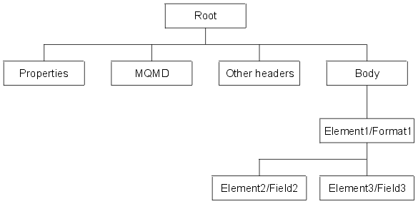

The same applies to JSON to XML. Your output root will not
have well formatted message trees. That means the nodes that are
downstream will fail while formatting the data
[JAN042021-IIBFileNodeBARMQReplyTryCatchFlowOrder](https://drive.google.com/file/d/15EypxxgHztb_VdEnJa82vgmFoQO7wY7L/view?usp=share_link)


# FileInput & FileOutput nodes

The FileInput node creates an **mqsitransitin** subdirectory in the
input directory. The mqsitransitin subdirectory holds and locks the
input files while they are being processed. The integration node reads
the file and propagates a message, or messages, by using the contents of
the file. By default the file is archived to 'mqsiarchive' under the
file input directory. If you select Move to Archive Subdirectory, the
source file is moved to the archive subdirectory of the input directory.
The subdirectory name is mqsiarchive. For example, if the input
directory is /var/fileinput, the absolute path of the archive
subdirectory is /var/fileinput/mqsiarchive. If this directory does not
exist, the integration node creates it when it first tries to move a
file there.

Specify a value for the Action on failing file property to determine
what the node is to do with the input file after all attempts to process
its contents fail: Move to Backout Subdirectory. The file is moved to
the backout subdirectory of the input directory. The name of this
subdirectory is mqsibackout. If the input directory is /var/fileinput,
the absolute path of the backout subdirectory is
/var/fileinput/mqsibackout. If this subdirectory does not exist, the
integration node creates it when it first tries to move a file
there.

FileOutput node: The file is then moved to the specified output
directory. If this transfer fails, you can specify if the file is
deleted, moved to the failure directory (mqsifailure), renamed before
being moved to the failure directory, or no action is taken on the file.

If an integration server that processes files in this input
directory is removed, check the mqsitransitin subdirectory for partially
processed or unprocessed files. Move any such files back into the input
directory and remove the integration server UUID prefix from the file
names, so that they can be processed by a different integration
server.

# Difference between DECLARE varName CHAR FIELDNAME() & DECLARE varName REFERENCE TO

If your JSON looks like

```
{
  "root":
  {

  "Number1":4,

  "Number2":2,

  "MathOp":"+",

  }

}
```

As well as this code:

```
DECLARE InRef REFERENCE TO InputRoot.JSON.Data.root;
```

The InRef is a reference variable pointing to part of the message tree
(root).

```
DECLARE mathOp CHAR InRef.MathOp;
```

mathOp is +

```
DECLARE Operation CHAR FIELDNAME(InRef.*[<]);
```

The FIELDNAME returns the name of the field identified by
source_field_reference inside () as a character value. If the parameter
identifies a nonexistent field, NULL is returned. Operation is now
MathOp (a string of type CHAR).


# LEAVE statement

The LEAVE statement stops the current iteration of the containing
WHILE, REPEAT, LOOP, or BEGIN statement identified by Label. The
containing statement's evaluation of its loop condition (if any) is
bypassed and looping stops.

*Syntax*

```
LEAVE *Label*
```

*Examples*

In the following example, the loop iterates four times:

```
DECLARE i INTEGER;
SET i = 1;
X : REPEAT 
  ...
  IF i>= 4 THEN
    LEAVE X;
  END IF;

  SET i = i + 1;
UNTIL
  FALSE
END REPEAT;
```

# ESQL field reference overview

For example:
```
InputRoot.XMLNS.Data.Invoice
```

A field reference consists of a correlation name, followed by 0 or more
Path Elements separated by periods (.). The correlation name identifies
a well-known starting point and must be the name of a constant, a
declared variable, or one of the predefined start points; for example,
__InputRoot__. The InputRoot is the root of the input message. The
OutputRoot is the root of the output message. Message trees could refer
to the input message or output message. The tree structure created by
the parsers is independent of any message format (e.g. XML). The
exception to this is the subtree created as part of the message tree to
represent the message body. For example, XMLNSC, JSON or DFDL.

Message Tree structure is populated with the contents of the input
message bit stream. It has a root element InputRoot. Each tree is made
up of elements. Root has a number of child elements.

The Compute node has an input message assembly and at least 1 output
message assembly. Configure the Compute node to determine which trees
are included in the output message assembly. If you want the output
message assembly to contain a complete copy of the input message tree,
you can code a single ESQL SET statement to make the copy.

```
CREATE PROCEDURE CopyEntireMessage() BEGIN
  SET OutputRoot = InputRoot;
END;
```

This procedure copies the entire contents of the input message tree
(Properties and MQMD which are the header & XMLNSC which is the payload)
to the output message.

If you want the output message to contain a subset of the input message
tree, code ESQL to copy those parts only.

```
SET OutputRoot.XMLNS.ResAdd.sp1:addC=
InputRoot.XMLNSC.sp1:ReqAdd.sp1:intA + InputRoot.XMLNSC.sp1:ReqAdd.sp1:intB;
```

The message tree is always present and is passed from node to node in a
single instance of a message flow. The message tree includes all the
headers, in addition to the message body.

The header of the message tree is the Properties & MQMD. The payload is
the XMLNSC in the [diagram](#converting-xmlnsc-to-json) and is also called the Body tree which is a
structure of child elements that represents the message content (data)
and reflects the logical structure of that content. The body tree is
created by a body parser. Each element in the parsed tree is either a
name, value or name-value element. The FIELDTYPE field function returns
the type of a given field. Named field types must be used with the
capitalization shown.

The following types are domain-independent:

- Name
- Value
- NameValue
- MQRFH2.BitStream
- MQRFH2.Field
- MQRFH2C.Field

Inside the main function after the 2nd call:

```
CREATE LASTCHILD OF OutputRoot DOMAIN('JSON');
CREATE LASTCHILD OF headerRef TYPE NameValue NAME 'InvoiceNumber' VALUE 'InvoiceNumber';
CREATE FIELD OutputRoot.JSON.Data;
```

LASTCHILD is a type of FIELD clause. "CREATE LASTCHILD OF" target
navigates to the target field and adds a new field as it's rightmost
child, displacing the previous last child to the left. The
DOMAIN('JSON') associates the new field with a new parser of the
specified type i.e. JSON. The second example creates a field using the
specified type, name, and value.

```
DECLARE outref REFERENCE TO OutputRoot.JSON.Data;
 CREATE FIELD outref.Purchases IDENTITY (JSON.Array)Purchases;
SET outref.Purchases.Item[1].Description = inRef.Description;

-- This creates JSON message under the Data element owned by
JSON parser root. This creates a child element of the OutputRoot
-- as a JSON. Since the JSON tree structure is JSON and data
this assigns InputRoot.XMLNSC to OutputRoot.JSON.Data.
```

You can manipulate messages that belong to the JSON domain, which are
parsed by the JSON parser. The code transforms the OutputRoot message to
JSON. The OutputRoot... statement produces a message tree.

If you include a FIELD clause the field specified by TARGET is
navigated to.

SET assigns a value to a variable.

XMLNSC parser is guided by the XML Schema (describes the shape of the
message tree which is a logical model). XMLNSC is the preferred domain
for parsing all XML because of it's high performance, reduced memory
used by the logical message tree created from the parsed message; which
has discarded non-significant whitespace, mixed content, comments,
processing instructions & embedded DTDs. XMLNSC parser can operate as a
model-driven parser and can validate XML messages against XML schemas,
to ensure XML messages are correct.

# Local, UDP (AKA External) & shared variables

Local variable scope is within the Compute node. UDP scope is
throughout the message flow. Shared scope is through the execution group
AKA the Integration Server even if the message flow completes. When the
next transaction starts the shared variable is available.

# MQInputNode mode. How your messages will be processed

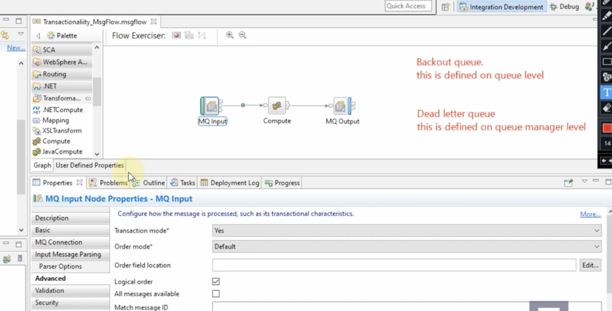

[Transaction Mode of MQ Input Node (Part1)](https://youtu.be/QGp83DeRoUs?si=BA8Iz6zAcy9FryfA)
Under Properties then Advanced there is a Transaction mode which relates to how your messages
are going to be processed.

This could be Yes (message is received but if there is an exception the
original message will go to a backout queue; which if defined is at the
queue level or DLQ; defined at QMGR level else it will loop), No or
Automatic. Imagine there is a problem in the compute node or suppose the
queue on the MQ output has a problem then the flow returns the message
to the MQInput node. If the IN queue has a backout queue defined the
message ends up on it. If not defined, then it goes to DLQ defined at
QMGR level.

If no DLQ then **continuous** loop. If while it loops I define a DLQ for
the QMGR then looping stops as the message goes to the DLQ.

If a DLQ or backout queue is defined but I change the Default
persistence of the IN queue to Not persistent then the message is
discarded.

If a DLQ or backout queue is defined but I change the Default
persistence of the IN queue to Persistent then the message is discarded
if the sending application has set persistence to No thereby overriding
the queue setting.

An exception could occur if the wrong data source is defined at the
Compute Node in between the MQInputNode and MQOutputNode. The
MQInputNode has a Basic tab under properties which has a Queue Name
field. If say IN.LQ is the value of that field then you need to define
the backout queue for that queue using MQ Explorer.

# MQOutputNode mode. How your messages will be processed

[Transaction Mode of MQ Output](https://www.youtube.com/watch?v=DiTdocdPc9w)

If the Transaction mode is Automatic then it will inherit from the MQInput node.

If the Transaction mode is Yes then it will wait for the whole flow
(Transaction) to complete before the MQPUT results in a message existing
on the output queue. The whole transaction is rolled back.

If the Transaction mode is No then it will NOT wait for the whole flow
(Transaction) to complete. The MQPUT will complete and a message put on
the output queue

# Scenario full queue MQOutputNode node

Look for "Resolving implementation problems when developing message
flows" in IBM's online ACE page. Then look for [Messages enter the
message flow but do not exit](https://www.ibm.com/docs/en/app-connect/13.0.x?topic=flows-resolving-implementation-problems-when-developing-message#au16530_2)

[DEC212020-IIB FixHTTPProdCon_ESQLThrow](https://drive.google.com/file/d/1-KG_swTi1BJSf9WFXBYR-PDvSR_UOSoV/view?usp=share_link)
33:52 minutes shows you how the flow looks.

> **_FUNDAMENTAL:_**  In a flow even if you have 30 nodes in a message flow, if any of the nodes throws an error, the transaction is rolled back to node 1 in your message flow.

When a rollback occurs the exception is in the ExceptionList tree at the end. If the first node's catch terminal is connected then the Message and ExceptionList trees are sent to the node connected to catch. That node could be a transaction node that reads the exception and maybe an MQOutput node that puts the message on a queue. That way the message is not lost.

If catch is not connected then it will try the Failure node. It will send the Message tree but not the ExceptionList. Instead of the ExceptionList it will send the default exception which will say "you did not handle the Catch terminal".

Another scenario is when the MQPUT command to the output queue that is defined on the MQOutput node may not successful because the queue is FULL. The Failure terminal of the MQInput node has not been
connected. Non-transactional messages are discarded. Whenever Transaction mode of the MQInput node is automatic, then transactionality is defined by persistence of the queue for the node. When queues are defined the Default persistence is 'Not Persistent'. 

So the behaviour is the same as when Transaction mode is 'No'. This means that, when the exception is not handled, the non-transactional messages are discarded.

When Transaction mode is Automatic and Default Persistance property on the IN queue is Persistent then (if DLQ on queue manager is defined) then the message persists to the DLQ.

Sometimes the app sending the message to the flow has a Persistent Msg setting:

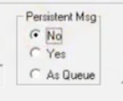

If you select No then it will override the queues "Persistent" setting and the message is lost.

When the transaction mode setting for MQInput node is Yes, MQOutput
node is Automatic (transactionality derived from the Input node), Input
queue IN's Default persistence is Not persistent, OUT queue is same as
IN.

If I change the persistence to Persistent for the OUT queue, it makes no
difference so I reverted. If I change the persistence to Persistent for
the IN queue then I see in the syslog:

```
"BIP2643W: Unable to commit a WebSphere MQ transaction; MQCMIT
failed; queue manager=QM3, MQCC=1, MQRC=2003."

"BIP2648E: Message backed out to a queue; message flow node
'EsqlThrowStmt.MQ Input'."
```

The message has been backed out to the DLQ for the QMGR.

# MQ Output

[DEC292020-IIB Timeout_LabelRouting_MultiQueues](https://drive.google.com/file/d/1sJ3i-KQYDRGw1UG38bU05uUMFCe6r-Pa/view?usp=share_link)

You can send the message to multiple queues in ESQL. You need to change the Compute mode
to LocalEnvironment and Message in the Compute node properties as well
as the MQ Output's Destination mode to Destination List. Use the
command:

```
SET OutputLocalEnvironment.Destination.MQ.DestinationData[1].queueName='OUT';
SET OutputLocalEnvironment.Destination.MQ.DestinationData[2].queueName='OUT1';
```

# MQ Reply

[JAN042021-IIBFileNodeBARMQReplyTryCatchFlowOrder](https://drive.google.com/file/d/15EypxxgHztb_VdEnJa82vgmFoQO7wY7L/view?usp=share_link) 24 minutes. The client
system sets the name of the queue the flow has to reply to. RFHUTIL
allows you to set the ReplyTo header setting.

# IIB Node Connecting to Database using ODBC pt1

Use the command console to associate a DSN with a broker instance. You
create an ODBC connection to the data source DBNAME with the
command:

```
mqsisetdbparms IB9BROKER -n DBNAME -u -p
```

You now need to reload the configuration since the new association of DBNAME to IB9BROKER:

```
mqsireload IB9BROKER
```

Then check the connection using 
```
mqsicvp IB9BROKER -n DBNAME
```

# IIB Node Connecting to Database using ODBC pt2

IIBGURU entered:

```
$ db2start


$ db2
db2 => connect to sample
db2 => SELECT * FROM EMPLOYEE
```


Create a new Application name DBINTER_APP. Then right click on
DBINTER_APP then create a message flow DBINTER_MF. From the palette add
MQInput and MQOutput nodes. In between add some ESQL in a Compute node.
MQInput out connects to the in of the Compute node. Compute out connects
to the in of the MQOutput node. MQInput node will use the XMLNSC parser
to read XML records

```
        9001
        TRUMP
        New York
```

...that will be INSERTED into DBNAME. The Compute node has Data Source
DBNAME. Double click on the node to bring up the ESQL
editor.

Uncomment --- CALL CopyMessageHeaders(); so that we can send a success
message to the out queue.
Compare this SQL

```
INSERT INTO EMPLOYEE VALUES(101,'IIBGURU','CALIFORNIA')
```

With what we use in ESQL Compute Node.

```
INSERT INTO Database.iibguru.EMPLOYEE
VALUES(InputRoot.XMLNSC.EMPLOYEE.ENO, InputRoot.XMLNSC.EMPLOYEE.ENAME, InputRoot.XMLNSC.EMPLOYEE.ECITY);
```

> **Note** You can use CTRL space to have content assist help with the syntax

The above could be written as:

```
  DECLARE InRef REFERENCE TO InputRoot.XMLNSC.EMPLOYEE;
  INSERT INTO Database.iibguru.EMPLOYEE VALUES(InRef.ENO, InRef.ENAME, InRef.ECITY);
```

We are getting the values from the Input message tree where the domain
is XMLNSC, EMPLOYEE is the root child. "Database" is a keyword & the
iibguru is the schema in which EMPLOYEE table exists. Here the schema is
the user name. It will use the user name as the schema if you have not
created the schema before creating a table in the database.

When you save the ESQL in the Compute node you get a warning
"Unresolvable database table reference 'Database.iibguru.EMPLOYEE'".
This is because it only resolves and finds EMPLOYEE during execution.
The successive command after the INSERT will only run if the INSERT
executes correctly. It is:

```
  SET OutputRoot.XMLNSC.DBINSERT.STATUS='SUCCESS';
```


Introduce a breakpoint after the MQInput. Since you have the breakpoint
you have to launch the debugger (right click on execution group) then
add a message from the XML file using RFHUTIL. In the Data tab of the
RFHUTIL you can parse the file to see if it is syntactically correct
under Data Format. Once you write the XML file to the IN queue the Debug
perspective is automatically launched. You will see multiple threads.
Thread suspended at DBINTER_MF at connection. You can click on the 'Edit
Source Lookup Path' button. From there you add a container to the source
lookup path. Since we are running a MF we choose the Message Flow
Container, choose our DBINTER_APP application which contains our message
flow. Under Variables you can see the Message. As you know the Message
has Properties then MQMD then Other headers then the Body which
has


```
  XMLNSC
  |
  |
  V
  EMPLOYEE
    |
    |
    V
    ENO (9001), ENAME (TRUMP), ECITY(New York)
```

We can go inside the scope of the Compute node by clicking on the
thread in the Debug perspective, then click on Step into code icon which
will open up the ESQL of the next Compute node. You will reach the CALL
CopyMessageHeaders(); You can then click on the Step over icon which
will run the CALL then take you to the INSERT. The CALL will copy the
headers to the output. EVEN though the INSERT has been executed the
change has not been committed to the database. This is because
the

```
INSERT INTO....
SET OutputRoot...
RETURN TRUE;
```

Are considered as 1 unit of work. Only until every command in the ESQL
happens without error & the ___whole flow___ completes will the
INSERT be committed. Else a rollback will occur. This is controlled by
the Transaction property of the Compute node. The possible values are
Automatic (default) or Commit. The latter will commit the INSERT once
the Compute node completes successfully. It will not wait for the whole
flow to complete.


***PATH AREA.CIRCLE*** this allows you to reference ESQL in another broker schema


# Oracle DB ESQL

DSN TEST_DSN, Schema is SYSTEM

```
DECLARE EMP ROW;

--- ROW is a datatype that holds a tree structure]

SET EMP.Result[] = SELECT * FROM Database.SYSTEM.EMP_DETAILS AS R WHERE R.EMPID=InRef.id;
```


We then send this XML:
```
SET OutputRoot.JSON.Data.Employee.ID = EMP.Result.EMPID; //only works with a single value not multiple
```

# PASSTHRU with EVAL

[EVAL function in ESQL](https://youtu.be/0CX9--Y2jOk?si=0Mx5cJC8IDdW2GL1)

Example of PASSTHRU where there are 2 procedures with the same name but
in ESQL files contained in different schemas. How can we invoke them
dynamically at runtime? We can use EVAL to run the procedure that is
connected to a key value in some incoming XML or JSON. For example if
the value is Professional then invoke the EmpDetails procedure in the
Pro schema. If it is Personal invoke the EmpDetails in the Personal
schema:

```
SET Emp.EmpRecord[] = PASSTHRU('SELECT * FROM EMPLOYEE WHERE EMPNO='||''''||EmpID||'''');
SET Emp.EmpRecord[] = PASSTHRU('SELECT * FROM EMPLOYEE WHEREEMPNO='||''''||EmpID||'''');

DECLARE DbRecords REFERENCE TO Emp.EmpRecord;

CREATE FIELD OutputRoot.JSON.Data.Employee.{EmpInFoType};

DECLARE outDetailsRef REFERENCE TO OutputRoot.JSON.Data.Employee.{EmpInFoType};

IF CONTAINS(EmpInFoType, 'Professional') THEN SET SchemaName = 'EmpProDet';
ELSEIF CONTAINS(EmpInFoType, 'Personal') THEN SET SchemaName = 'EmpPersonDet';
END IF;

EVAL('CALL '||SchemaName||'.EmpDetails(outDetailsRef, DbRecords);');

RETURN TRUE;
```

This video also shows you how to use EVAL.
[EVAL function in ESQL || Explained with two Practical Examples](https://youtu.be/0CX9--Y2jOk?si=h0r2PTL2h-y_qw-x). EVAL saves you from having to write lots of if statements by evaluating the expression on the fly using variables.

Example:
```
SET OutputRoot.JSON.Data.Result = EVAL('num1'||mathop||'num2');
```

Instead of:

```
IF mathop = '+' THEN
  SET OutputRoot.JSON.Data.Result = num1 + num2;
```

# Shared variable and ATOMIC block

[What is Atomic block in ESQL?](https://youtu.be/u5-r4H6PvIY?si=kVKM9JrdJnXVlj6p)

```
DECLARE MYROW ROW; --A row variable contains an array
```

ROW SHARED variables can hold complex tree structure. A shared ROW can contain the result of a SELECT on the database table being cached.

```
DECLARE CACHE SHARED ROW; --For example, a database table called
"AIRPORTS" contains two columns, "CODE" and "CITY". This code loads the cache:
SET CACHE.AIRPORT[] = SELECT A.CODE, A.CITY FROM Database.AIRPORTS AS A;
```
The CACHE variable will be populated like this:

-- CACHE.AIRPORT[1].CODE = AAA

-- CACHE.AIRPORT[1].CITY = Anaa

-- CACHE.AIRPORT[2].CODE = AAB

-- CACHE.AIRPORT[2].CITY = Arrabury

Accessing ROW SHARED variables is much faster than retrieving the data
from the Database directly depending the amount of data retrieved. The
first time after the ESQL code is run CACHE shared variable is in
memory. The next time it is invoked it does not have to reload from the
database as it is cached.

The problem with this cache structure is that it doesn't scale. A user
trace will show that SELECT scans the table sequentially until it finds
a row that satisfies the WHERE clause. As the table grows, the search
gets slower. There comes a point when it's faster to drop the cache and
go to the database each time. 

> Ref:
[Efficient Caching](https://www.websphereusergroup.co.uk/wug/presentations/38/EfficientCaching\_-V2.pptx.pdf)

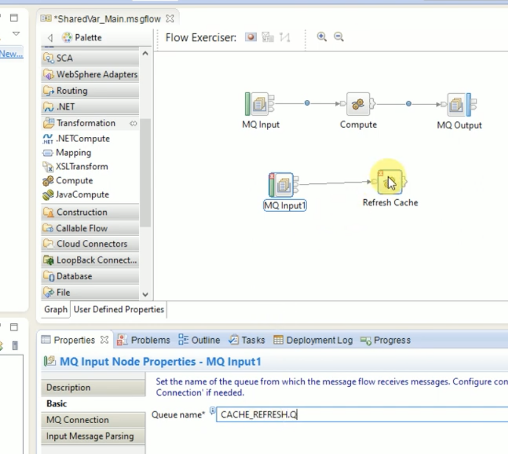

Whatever is stored in a shared variable is held in cache memory until
we refresh the execution group, application or application flow using
'mqsireload' for example. Other message flows in the same execution
group access the shared row variable value set in a message flow.

Once a cached shared row is populated then every time the flow will run
it will only have what was loaded at the time of the SQL query. This
means that the underlying database values may change but this won't be
reflected.

In a PROD environment you can't run 'mqsireload' all the time as that
would impact LIVE services. One option is to create a CACHE queue on the
queue manager. This could be referenced in the properties of the same
flow but in a separate MQ Input node connected to a Compute node. Within
the Compute node you can empty the shared row variable:

```
SET CACHE = NULL;
```

When ESQL code in other compute nodes access the variable, they will
see it is empty, which prompts another SELECT against the database. If
the "SET CacheTable = NULL;" is executed just before "SET
OutputRoot.XMLNSC.Data = CacheTable;" then the output message assembly
will have no data.

To get around this use atomic blocks [(reference the link at the beginning of this header)](#shared-variable-and-atomic-block)
 within the same
schema to ensure that threads are executed serially (only 1 thread is
executed at a time). That way we can update the shared row variable in a
thread safe manner.


shared_atomic_Refresh_Cache.esql
```  
  BEGIN
    X: BEGIN ATOMIC
      SET CacheTable = NULL;  --Empties CacheTable
    END X;
      RETURN TRUE;
  END;
```

shared_atomic_Compute.esql

```
  BEGIN
    X: BEGIN ATOMIC
      IF NOT EXISTS(CacheTable.[]) THEN -- Does not check if CACHE exists but if data is in it.
        SET CacheTable.Result[] = PASSTHRU('SELECT R.FIRSTNME,R.LASTNAME FROM EMPLOYEE AS R');
        SET OutputRoot.XMLNSC.Data = CacheTable;
      
      ELSE
        SET OutputRoot.XMLNSC.Data = CacheTable;
      END IF;
    END X;
    RETURN TRUE;
  END;
```

Both atomic blocks must use the same X label. Now the CacheTable cache will not be refreshed just before setting the output root since the X atomic blocks have to run one after the other in their entirety.

One advantage of the Global Cache over ESQL shared variables is that
the cache can be shared between message flows, integration servers
execution groups, and integration brokers (recall that the scope
of ESQL shared variables is the message flow). However, because Global
Cache uses the JVM to store data (Udemy 18) it is slower than shared
variables which use cache.


# The THE function returns the first element of a list.

*Syntax*

THE(ListExpression)

If *ListExpression* contains one or more elements; THE
returns the first element of the list. In all other cases, it returns an empty list.

*Restrictions*

*ListExpression* must be a SELECT expression.

# DATE TIME TRANSFORMATION

IBM help "formatting and parsing date times as strings" under help in
the toolkit (Search for parsing date and time). How do we interpret date
formats?  12-09-2015 12:05pm. This is called a timestamp as it has a
time component  The first 2 digits are the day in the month. We want to
transform to :
Month in 3 letters/day in the month with 0 as padding/4 digits
year:hours,mins,seconds

```
        DECLARE INDATE CHARACTER '12-09-2015 12:05pm';

        DECLARE INDATEFORMAT CHARACTER 'd-MM-yyyy h:mma';
        --This tells us how to interpret the string in a format IIB understands
        DECLARE STDDATE TIMESTAMP CAST(INDATE AS TIMESTAMP FORMAT INDATEFORMAT);
        --We have to change it to a standard date using cast
        DECLARE OUTDATEFORMAT CHARACTER 'MMM/dd/yyyy:hh,mm,ss';
        DECLARE OUTDATE CHARACTER CAST(STDDATE AS CHARACTER FORMAT OUTDATEFORMAT);
```

He then deploys the application to the execution group.  Iibguru then
sends a blank message to the IN queue that mqinput node connects to.
Then the esql above triggers the code. The thread stops at the breakpoint
in between. Then he steps into the code, then steps over. He can see the
values of the DECLARED variables as they change.

# INTERVAL DATATYPE
How many either days, months, years (up to you) between either 2
timestamps or dates. Uncomment --- CALL CopyMessageHeaders(); so that we
can send a success message to the out queue.

```
DECLARE INDATE DATE '2009-09-17';
--- The type is DATE not CHARACTER since it is a standard date format.
--- When you run with breakpoints you will observe the variable as
--- INDATE:DATE:java.util.GregorianCalendar[time=12531....] 
--- & OUTDATE as 2009-10-17
DECLARE OUTDATE DATE INDATE+INTERVAL '1' MONTH;
```

If you want to see what day this date is:

```
DECLARE DAYFORMAT CHARACTER 'EEE';
DECLARE DAYNAME CHARACTER CAST(OUTDATE AS CHARACTER FORMAT
DAYFORMAT);
```
---DAYFORMAT is EEE, DAYNAME is Sat
---if DAYFORMAT is EEEE, DAYNAME is Saturday
---if DAYFORMAT is 'EEEE W', DAYNAME is Saturday 3 where 3 is the 3rd Saturday of that month

```
DECLARE SUBDATE CHARACTER (CURRENT_DATE-INDATE) YEAR;
---This will return an interval string not a DATE type. Hence we use CHARACTER not DATE.
SUBDATE Value is INTERVAL '8' YEAR]
DECLARE SUBDATE CHARACTER (CURRENT_DATE-INDATE) YEAR TO MONTH;
--- SUBDATE Value is INTERVAL '7-09' YEAR TO MONTH
```

If you want the differences in hours then change the INDATE
declaration from DATE type to TIMESTAMP type:

```
DECLARE INDATE TIMESTAMP '2009-09-17 13:53:25';
--- You also need to change the SUBDATE to:
DECLARE SUBDATE CHARACTER (CURRENT_TIMESTAMP-INDATE) HOUR;
```


# Transformation Extender

CloudPak is a pack made up of IIB, MQ, WTX, DataPower & API Connect.
WTX is coding free transformation but in IIB we can do transformation in
5 coding languages. Data transformation engine at the core of IBM TX.
Consider the following data stream for which ITX has an adapter Paul
Brett Operations 1/4/1970.
The data stream is read into a type tree. Consider this tree to be a
type of bucket. This bucket can hold further buckets. This can be
transformed into: Paul Brett Operations 1970-04-01.
The output adapter sends the XML to either MQ, a file or something else.
WTX protocol support is less.

# Message Set, Message definition creation

> Reference [IIB Message set, Message Definition creation](https://youtu.be/ZC_uDGzhKIs?si=Bz4sfjpp9vF-Wpbs) & [Udemy Section 15:60](https://www.udemy.com/course/ibm-integration-bus-with-practicals/learn/lecture/28717792#overview).

For XML and JSON Message Modelling is optional. But for CSV, Flatfile,
EDI, HL7, SWIFT, COBOL etc it is mandatory. Message model schema files
are the preferred way to model messages for most data formats. How are
you going to create these and implement them as part of the message
flow? A request or response message needs to be defined. What are the
individual fields or field values contained therein? Parsing is
segregating the different parts of the message and interpreting what
each part means.
A message set can contain 1 or more message definitions. A message set
has a unique ID.


The message definition defines the field names, data types, delimiters.
This definition helps with say a message transformation. Consider the
following data 123:raju:detroitCRLF.
The carriage return, line feed can be seen in Notepad Plus Plus. CRLF
appears in Windows, LF appears if created in Linux.
In IIB Toolkit go to New -> Other -> Message Set. Give it a name of
Delimited_ms, give Delimited_msp for the project name. Click next then
select the type of message data most appropriate. We choose Text data.
Take a note of the next windows message domains (MRM which is the
default), wire formats (Text1), and Schemas (None). You will see your
newly created messageSet. Change the default wire format to Text1.

Remember message set ID is different from MQ message ID. The latter is
an MQMD (message queue message definition)
property.

You then right click on Message definition -> New -> Other -> Message
definition -> Message Definition File.
Click Next and name the file colonseparated_msd. Right click on Elements
and Attributes -> create Global element (lowest level).
The 3 fields combine to make a single record. That record should be
given a name and the name added to Types. Add it as a Complex type. In
order to tell IIB that ERECORD is a composite of the 3 fields right
click on ERECORD then Add Element Reference.

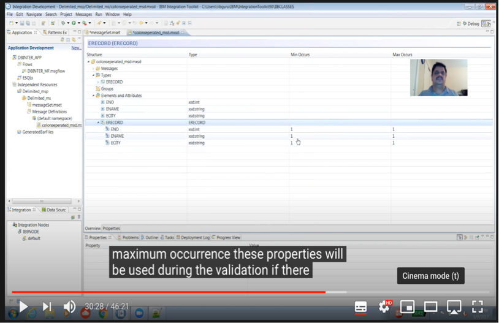

You need to go to Properties of ERECORD then select all elements
delimited then add colon for delimiter. When you test this using
MQInputNode you need to set the correct wire mode else you will get
"Invalid Wire format retrieved". This message is a sign that you have
not given Broker the correct definitions for it to interpret the text
received.
We need the message definition we created to be referenced correctly in
the MQInputNode -> Input Message Parsing. Under Message model it should
show you the message set but it does not unless you let the application
have access to the MS which is an independent resource. You need to
change the applications properties -> Project References -> Choose
Delimited_msp. NOW you can select Delimited_ms in the Input Message
Parsing. This also allows you to select ERECORD as the Complex message
definition. Physical format is the Text1 wire format.
When you see the Variables under the running thread you will not see the
ERECORD Complex type since it has been replaced by the MRM. Any
top-level Complex type of a text delimited message definition is going
to become MRM. You will see the children of MRM (ENO,ENAME,ECITY).

# Message Set, Message definition creation for XML

Message set will only tell you the format. But the actual schema XSD
will be in the Message definition. In the New Message Set wizard after
giving the message Set and project names click Next. Then choose "XML
documents" as the type of message data then Next. Wire formats is None
and Schemas are None. As ever the next step is to create some message
definitions in the same message sets. You can create them from XSD
files.

# Message modelling

[JAN192021-IIB JCN_ForLoop&JDBC&ModellingPt1 18 minutes](https://drive.google.com/file/d/1dm5ErDsUbQ80Ln-EGWGrCF6UABv85uNE/view?usp=share_link). The modelling
of a message can be achieved in the message set and definition as above
or within an IIB Message Model as introduced in version 8. You can
reference the Message Set and one of it's Definition objects in code.
The Message Model is the more advanced concept over Message Set and
Definition because you can test your model including performance without
deployment ('Test Parse Model' in the model xsd window JAN212021-IIB
ModellingPt2&Mapping). For example, you can model a CSV file. The model
should be in a container like a library or an application.

DFDL is a more advanced version of MRM. If you model the data using the
Message Set and message definition, then the parser is MRM. However, if
you model your data using the Message Model then the parser is DFDL.
Refer to 14DEC2020-IIBMSetMDef.mp4 27:24 and
IBM/IIBT10/workspace/MindMajix/David/CSV_XML_MessSetDEMO_MF_Compute.esql

In your MQInput node there is an Input Message Parsing tab. When you
are expecting MRM, you need a Message value of say {}:IN. This is in
your Message definition. You will see this appear as MessageType in your
Message -> Properties in debug. If you want to convert from, say XML,
to CSV you cannot set the MQInput node properties in the MQOuput node.
You need a Compute node with this:

```
SET OutputRoot.Properties.MessageSet='csvSingleLine';
SET OutputRoot.Properties.MessageType='{}:TargetMessag';
SET OutputRoot.Properties.MessageFormat='Text_CSV';
```

If your incoming data contains a header and a trailer, then use
record-oriented text and select 'The first record is a header' in the
wizard.

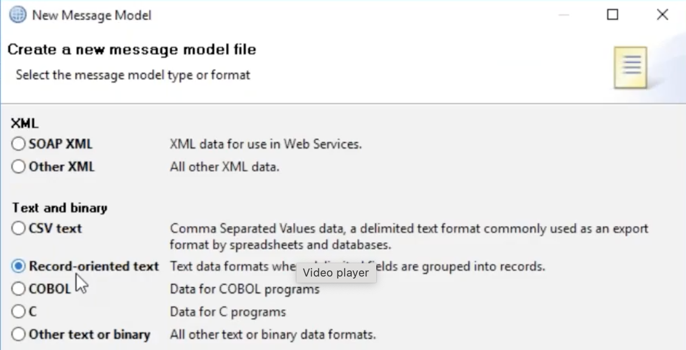

[JAN212021-IIB ModellingPt2&Mapping 12 minutes](https://drive.google.com/file/d/1ESpoPURJo-q4rYdCjFCHWRGS9_VoTbJ8/view?usp=share_link). We saw the
transformations with ESQL and the JCN. If you don't want to write a
single line of code, then the mapping transformation node helps.
However, you cannot do complex transformation using the mapping node.
You can only do minimal types of transformations like converting XML to
JSON, fields mapping, string values or static values.

You can refer to Message Models in a Mapping node. But the Mapping node
cannot reference an existing message set/definition

Another fundamental point is that generally for XML & JSON 99% of the
time we don't model since the description of what the data values mean
is already defined (for example Edetails.xsd). But, if you are planning
on doing the transformation using the mapping node, then you need to
model the data in a Message Model, even if that data is XML or
JSON.

When you send CSV data set the Content-Type to text/csv in the Postman
client. You might have a parsing issue depending on whether the text
file has CR & LF at the end of the line (windows) or just LF (Unix,
macOS). You can run xxd - make a hex dump or do the reverse (reference:[Linux Tips and Tricks - Line Feed and Carriage Returns]
(https://youtu.be/VRwFvt5eHeA?si=X3LOsTz6fdPoQrQS) e.g. 'xxd
Bill_Piped_delim.csv'. If your file does not have CR then remove CR
from the sequence in the Message Model. Reference:
[iib - convert csv to xml  15:32](https://youtu.be/qXwYJGsgw8c?si=ahdxMt1nlHJ6tVI4). I can use 'od
-c filename' in order to see the escape characters. Remember that \\n is a line feed.

# Mapping XML from an XSD

[JAN212021-IIB ModellingPt2&Mapping 16 minutes](https://drive.google.com/file/d/1ESpoPURJo-q4rYdCjFCHWRGS9_VoTbJ8/view?usp=share_link). The
IBM/IIBT10/workspace/LIB_MODEL/Edetails.xsd file models the data for the
incoming XML. It is generated online using an existing XML file as a
template. The XSD file validates the XML and also speeds up development
of your integration applications by enabling ESQL content assist and
graphical maps.

The MAP_PRO application references the LIB_MODEL we created. When we
create a new message model file from the Edetails.xsd file we import it
into our workspace library LIB_MODEL.

When we double click on the mapping node a wizard opens. We choose the
'Edetails' model as the map inputs and the 'csvone' model as the map
outputs. Click next then choose DFDL as the output domain. This is
correct since we created 'csvone', using DFDL.

The graphical map opens up.


The root of the left XML message assembly is Edetails. The Edetails
[1..1] tells us there is at least one details group. The input XML
looks like this.

```
<Edetails>
  <Ename>David</Ename>
  <Eid>478</Eid>
  <Estate>Juhu</Estate>
  <Ecountry>IN</Ecountry>
</Edetails>
```

The fields [1..1] means there must be at least one occurrence in the
output assembly. But the input assembly does not move any values to
those fields. That is why we Assign a dummy value in the Assign
Properties -> General -> Value field.

# Mapping XML with multiple records from an XSD

[JAN192021-IIB JCN_ForLoop&JDBC&ModellingPt1](https://drive.google.com/file/d/1dm5ErDsUbQ80Ln-EGWGrCF6UABv85uNE/view?usp=share_link). You can edit your
mapping so that it has different map inputs and outputs. You can delete
the existing input/output using the red cross. From this XML we modelled
mulxml.xsd.

```
<Empdetail>
  <Emp>
    <Ename>David</Ename>
    <Eid>478</Eid>
    <Estate>Juhu</Estate>
    <Ecountry>IN</Ecountry>
    <Eage>35</Eage>
    <Egend>m</Egend>
    <Edoj>1222</Edoj>
  </Emp>
  <Emp>
    <Ename>Amit</Ename>
    <Eid>3269</Eid>
    <Estate>Osterley</Estate>
    <Ecountry>UK</Ecountry>
    <Eage>52</Eage>
    <Egend>m</Egend>
    <Edoj>1217</Edoj>
  </Emp>
</Empdetail>
```

[JAN212021-IIB ModellingPt2&Mapping 35 minutes](https://drive.google.com/file/d/1ESpoPURJo-q4rYdCjFCHWRGS9_VoTbJ8/view?usp=share_link). Since both the XML and
CSV model are multiple records, you go with the For Each in the Mapping
GUI.

# Web Services

[Synchronous versus Asynchronous](https://youtu.be/N5Ky-mz6n-8)


SOAP is only XML, but HTTP can handle any format be it XML, JSON,
delimited, HL7 etc. SOAP is XML over HTTP or JMS HTTP + SSL = HTTPS but
XML uses WS-SEC. [DEC192020-IIB ProdConsumeHTTP.mp4 23minutes](https://drive.google.com/file/d/1Cid9C8_q_0l_EJ92kAf6MZP9tCe3-7Hg/view?usp=share_link)

HTTPInput listens for a request whereas HTTPReply is responsible for
responding to the consumer. HTTPInput listens on a port. There may be
multiple web services listening on the same port. To differentiate use
the path suffix for the URL

```
mqsireportproperties IIBGURU -e IIBGURU_EX -o HTTPConnector -r
```

HTTPInput can expose the service using different methods
(GET,HEAD,POST,PUT,PATCH,DELETE,OPTIONS) so you can't expect just to
hit with a browser.

Because the Transformation node has:

```
SET FNAME=InputRoot.XMLNSC.EMPDET.EFNAME
```

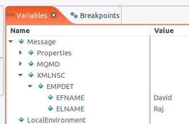

That means we are expecting a payload. GET does not have a payload.
Coordination of the millions of requests going through this flow is via
the LocalEnvironment -> Destination -> HTTP -> RequestIdentifier
(some unique number). Whenever the flow applications replies back to the
HTTP client it uses the same unique number.

In [DEC192020-IIB ProdConsumeHTTP.mp4](https://drive.google.com/file/d/1Cid9C8_q_0l_EJ92kAf6MZP9tCe3-7Hg/view?usp=share_link) the IIB Demo as a
consumer and producer calling local HTTP Service and Internet
Pokemon.

# SOAP Gateway mode

You can operate SOAP without a WSDL in gateway mode. There are 2
operation modes "Specify WSDL interface to expose" & "Operate in gateway
mode". Operation mode is the manner in which messages are routed by the
SOAP Input node. If you choose gateway mode, then Validation is not
enabled. In the default mode the WSDL will contain the rules to validate
against.

However even in Gateway mode the SOAP Input won't accept any kind of
message; it still expects SOAP format. You will get an "Exception during
creation of SOAP envelope structure" if your request is not SOAP XML
format. This is because the SOAP Input property's Input Message Parsing
still has SOAP in the message domain setting even after choosing Gateway
mode.

# Exposing SOAP webservice. WSDL creation

HTML page is human consumable. But a web service is code consumable.
Imagine bits of code talking to each other.
A web service is either SOAP or more recently REST API. SOAP needs a
WSDL file [JAN132021-IIB Containerization_SOAP_Reseq](https://drive.google.com/file/d/1eOZELZKs3rqFAk2HFLeYyi3dSOFpxAfP/view?usp=share_link). We also need a
message definition to describe the request and response data. Our
calculator SOAP service will have a single message definition to define
the numbers to be added and the result.

We now need to create a WSDL out of the message definition. Just right
click on the mxsd then generate WSDL.
WSDL (Web Service Description Language) is like an interface. You don't
care what happens internally. You only care about how to interface with
the service.
At the upper level WSDL has a service, service has a binding, binding
has a port type, port type has an operation, operation has a message
then message has a data types. The lowest component is data type which
is akin to an XSD.
You then right click on Message definition -> New -> Other -> Message
definition -> Message Definition File

You need to specify the target namespace. This allows you to separate
elements with similar names. [JAN132021-IIB Containerization_SOAP_Reseq 9
minutes](https://drive.google.com/file/d/1eOZELZKs3rqFAk2HFLeYyi3dSOFpxAfP/view?usp=share_link). You also need to Generate WSDL definition. This requires a
setting to allow this option in the toolkit.

# REST

Client <-transfer---Representational Data---transfer>API -> Server

Below ReqAdd is a resource that is represented by intA & intB and their
data types.

[JAN052021-IIB_REST](https://drive.google.com/file/d/1XCa9mrnTIm-EZ4Y8gz68fTWYzb2jO_Ps/view?usp=share_link). REST is an architectural concept. You are trying to
expose HTTP operations with appropriate HTTP methods. The equivalent to
the WSDL file is the swagger document. This is where you define the
request and response for GET, POST etc. You also define the data types
of those elements. The format is mostly JSON since it is the fastest
transformation through the layers. COVID data is in JSON. In IIB the
swagger is automatically generated but you can import the swagger. IIB
version 10 introduced REST API wizard. When you double click the message
flow the REST API editor opens. If you right click and open with the
message flow editor, you will see an HTTP Input and HTTP Reply nodes
either side of a route to label node. As you make changes to the REST
API editor the swagger "paths" : {} gets updated with your operations
as well as the message flow.

You then create a subflow for the operations in the REST API editor.
Add a transformation node (Compute).

```
CAST with CCSID. InputRoot.Properties.CodedCharSetId (this will be
populated by the Broker).

SET OutputRoot.JSON.Data.Result = CAST(InputRoot.JSON.Data.One AS
INTEGER CCSID InputRoot.Properties.CodedCharSetId ENCODING
InputRoot.Properties.Encoding) + CAST(InputRoot.JSON.Data.Two AS INTEGER
CCSID InputRoot.Properties.CodedCharSetId ENCODING
InputRoot.Properties.Encoding);

SET OutputRoot.JSON.Data.Result = CAST(InputRoot.HTTPInputHeader.One AS
INTEGER) * CAST(InputRoot.HTTPInputHeader.Two AS INTEGER); #JAN072021-IBM
IIB REST_GET_SSL_DB you can send data via the header and use the GET
operation
```

You can add a Request schema via the model definition in the REST API
editor then you can add one, two and three elements as string. You can
also use Parse Query String property in the HTTP Input node. If an HTTP
request to http://localhost:7800/MessageFlow1/a%20space/b/c, the request
is routed to the message flow that is deployed with the HTTPInput node,
and the path segments are be placed in the local environment tree.
[JAN072021-IBM IIB REST_GET_SSL_DB 11:46](https://drive.google.com/file/d/1o6TpH129InsCw8LWumlPOqUrfjgZU7O_/view?usp=share_link)

But the problem with the specification is that the keys and values,
even the number of parameters in your JSON request are not validated
even though your model specifically said the parameters have a certain
case, are required and are type string. Only thing that is validated is
that JSON is proper JSON format

# HTTPS webservice

[JAN072021-IBM IIB REST_GET_SSL_DB 20:50](https://drive.google.com/file/d/1o6TpH129InsCw8LWumlPOqUrfjgZU7O_/view?usp=share_link). IIB you can either consume
HTTPS webservice or expose it. HTTPS is a transport layer security. When
you are exposing the service, you are the provider. You will have a
keystore. When you are consuming you are the client, and you will have a
truststore.

In ikeyman create a keystore of type JKS called tstore.jks.

(JKS, Java Key Store. You can find this file at
sun.security.provider.JavaKeyStore. This keystore is Java specific, it
usually has an extension of jks. This type of keystore can contain
private keys and certificates, but it cannot be used to store secret
keys. Since it's a Java specific keystore, so it cannot be used in
other programming languages. The private keys stored in JKS cannot be
extracted in Java.)
The tstore.jks is protected by a password. If we are planning to use
tstore.jks as a keystore (since we are the provider) then we choose
personal certificate from the ikeyman dropdown. If we are using the file
as a truststore (since we are consuming a service) we choose Signer
certificates.


# Java and Java Compute Node

[JAN082021-IIB ExtJavaCall_DbNode_MQReplyPubSub](https://drive.google.com/file/d/1-IJJvmRgPg6FxfbKL6MKDrQzAwPy2h9c/view?usp=share_link)

```
--Creating Procedure For Calling External_Java_File(REGSTR.java),method RECORDS
CREATE PROCEDURE EXJAVACALL(IN PRO1C INTEGER,IN PRO2C INTEGER,IN VNAME CHARACTER) RETURNS CHARACTER LANGUAGE JAVA
EXTERNAL NAME "com.mss.REGSTR.RECORDS";
```

IIB 10 uses IBM java which includes oracle java's 1.7 features. IBM
Integration Bus v10 ships with Java 8 in IIB 10.0.0.11 and later fix
packs on all supported distributed platforms except Solaris and HP.
However, the IIB Toolkit is unable to compile Java source code
containing Java 8 language constructs such as Functional Interfaces,
default and static methods in Interfaces and Lambda Expressions. If you
try to deploy a bar file which contains or references Java 8 compiled
class files to an IIB node running 10.0.0.10 or earlier then you may see
one of the following errors: JavaCompute node with an onInitialize
method BIP4157E: The user-defined node 'Java Compute' could not be
deployed. Details: java.lang.UnsupportedClassVersionError: JVMCFRE003
bad major version class=Java18Test, offset=6.

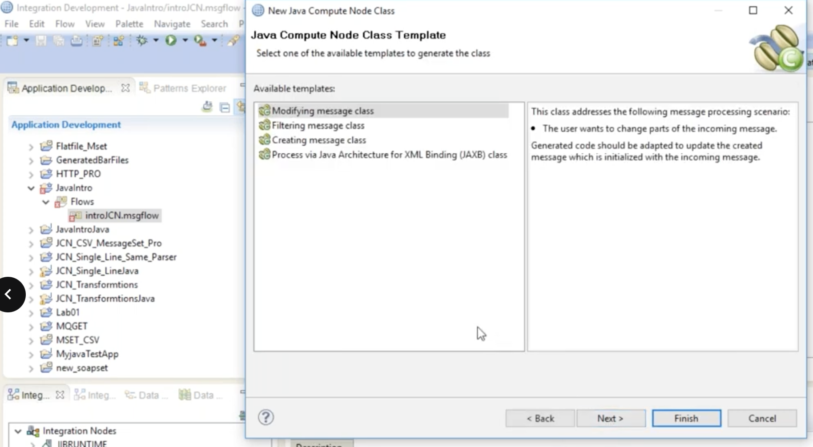

MbJavaComputeNode is the superclass of all the classes used in JCN.

[JAN182021-IIB JCN_MessSet 5:08](https://drive.google.com/file/d/1IzB8MWQEh2HPMKkJkW2gxkHXKuraxiGI/view?usp=share_link)
The Filtering message class in JCN wizard is not aimed for transformation. It can't construct the new message. It is used to check the data without changing it like a filter node, then
apply filtering rules.
JCN template for Java Architecture for XML Binding (JAXB) class relates
to marshalling and unmarshalling. Java classes are generated from an
XSD. You can create new XML data using the constructor's classes and
methods. You can also read newly created XML data.

When you have finished the template wizard you will see extends
MbJavaComputeNode. This superclass is an abstract class. It has abstract
methods and concrete methods. Abstract methods that are already
implemented can be called in our JCN. With concrete methods are not
implemented so we need to implement the declaration. The evaluate method
is a concrete method that we need to implement. The evaluate method is
akin to the Main method in ESQL.

```
public void evaluate(MbMessageAssembly inAssembly) throws MbException {
  // evaluate is akin to the CREATE FUNCTION Main() RETURNS BOOLEAN

 
// MbMessage root1 = inAssembly.getMessage(); // access Input tree
MbElement root = inAssembly.getMessage().getRootElement(); // InputRoot
MbElement Body = inAssembly.getMessage().getRootElement().getLastChild().getLastChild(); // Data under XMLNSkC

String jlKt=""; 

// Outputtree pointer
MbElement xmlnsc = outAssembly.getMessage().getRootElement().getLastChild();

// INPUT
MbElement empDetails=root.getLastChild().getLastChild().getFirstChild();
// MbElement empDetails=root.getLastChild()
String SName=empDetails.getFirstChild().getValueAsString();
String SmpID=empDetails.getFirstChild().getNextSibling().getValueAsString();
String SmpAge=empDetails.getFirstChild().getNextSibling().getNextSibling().getValueAsString();
```

The MbMessageAssembly is capable of holding the entire logical tree.
The logical tree consists of 4 trees:

1. message tree (properties, MQMD, XMLNSC)
1. LocalEnvironment
1. Environment
1. ExceptionList

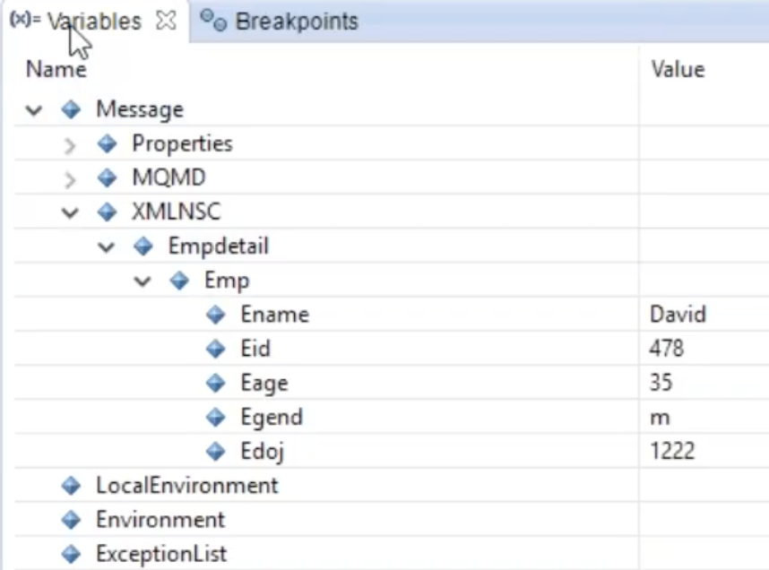

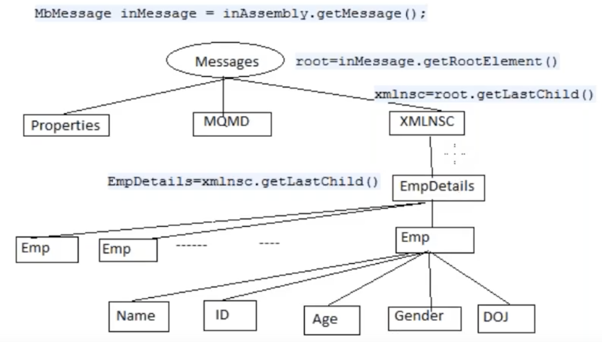

# Connect DB JAVA type 4 driver

[JAN072021-IBM IIB REST_GET_SSL_DB 32 minutes](https://drive.google.com/file/d/1o6TpH129InsCw8LWumlPOqUrfjgZU7O_/view?usp=share_link). Before we connected using
the ODBC driver which is an operating system dependent driver. This is a
pure java driver that connects using the Java API calls. The DB vendors
like IBM and Oracle will provide the JAR files to connect to their
databases. In IIB you need to enable some settings in the Configurable
Services [JAN192021-IIB JCN_ForLoop&JDBC&ModellingPt1 8 minutes](https://drive.google.com/file/d/1dm5ErDsUbQ80Ln-EGWGrCF6UABv85uNE/view?usp=share_link). You can
make changes that will be registered to the broker (right click broker
in the toolkit, then select 'Start Web User interface'). Use the
"mqsireportproperties brokerName -c AllTypes -c
AllReportableEntityNames -r". From the output you can see the different
connectionUrlFormat for DB2, Oracle, MySQL etc.\
connectionUrlFormat='jdbc:db2://serverName:[portNumber]/databaseName:user=[user];password=[password];'
connectionUrlFormat='jdbc:oracle:thin:[user]/[password]@serverName:portNumber:[connectionUrlFormatAttr1]'\
JDBCProviders is the Configurable service that we need to Configure. We
also need type4DriverClassName='com.ibm.db2.jcc.DB2Driver' which we
will reference in the code. This class is available in the DB2 JAR
file.

You should also tick the exception option in the properties. For
example if you are using HTTP then the response will  contain the
error.

BIP2322E: Database error: SQL State ''IM002'';
Native Error Code '0'; Error Text
''[unixODBC][Driver Manager]Data source name not found and
no default driver specified

[ ]


# Deciding Between ODBC and JDBC Drivers

[ The following points may help: ]

Multithread: - JDBC is multi-threaded - ODBC is not multi-threaded (at
least not thread safe)

Flexibility: - ODBC is a windows-specific technology - JDBC is specific
to Java, and is therefore supported on whatever OS supports Java

Power : you can do everything with JDBC that you can do with ODBC, on
any platform.

Language: - ODBC is procedural and language independent - JDBC is object
oriented and language dependent (specific to java).

Heavy load: - JDBC is faster - ODBC is slower

ODBC limitation: it is a relational API and can only work with data
types that can be expressed in rectangular or two-dimensional format.
(it will not work with data types like Oracle's spatial data type)

API: JDBC API is a natural Java Interface and is built on ODBC, and
therefore JDBC retains some of the basic feature of ODBC

# Design, requirements gathering

What questions will you ask? How will you implement these? For example,
if you want to expose a web service what kind of notes will you
take?

# MQRFH2 Tree

The MQRFH2 header is used to pass messages to and from an integration
node that belongs to IBM® Integration Bus. In a message, the MQRFH2
header follows the WebSphere® MQ message descriptor (MQMD) and precedes
the message body, if present.

What is the use of MQRFH2 header? You can pass application data to
[other] flows if the protocol is MQ. In the example below
the MQ Output puts a message to a queue called test2. That then triggers
another message flow called SecondFlow.msgflow which has an MQ Input to
receive the message. You cannot use Environment.Variables.orderPerson
when traversing from FirstFlow.msgflow to SecondFlow.msgflow. So how can
you pass the data in Environment.Variables.orderPerson?

In the flow below the environmental variable is not available for the
"call Service" but is accessible from the compute nodes. The 'call
Service' contains:

SET OutputRoot.XMLNSC.ServiceResponse =
InputRootXMLNSC.shiporder.shipto;


In the first flow: SET Environment.Variables.orderPerson =
InputRoot.XMLNSC.shiporder.orderperson;

[This variable is then needed in the second flow:]

SET OutputRoot.MQRFH2.usr.oPerson =
Environment.Variables.orderPerson;

Since the Compute1 node has an Out1 → HTTP Reply and Out → MQ Output
you need to construct a message for the tree that will go to HTTP Reply
& a different message tree that goes to MQ Output.

[CALL CopyMessageHeaders();]

[DELETE FIELD OutputRoot.HTPResponseHeader;]

[SET OutputRoot.XMLNSC.Acknowledgement = 'Sent to Downstream';]

PROPAGATE TO TERMINAL 'out1'; --this goes to the HTTP Reply which
sends a response to the client that initiated the HTTP request

(FYI if you added DELETE NONE to the last ESQL it will not delete the
Message Assembly/Logical Tree after propagating)

------------ Second message assembly being constructed from
scratch again

[SET OutputRoot.Properties = InputRoot.Properties;]

[SET OutputRoot.MQMD = InputRoot.MQMD;]

[DELETE FIELD OutputRoot.HTPResponseHeader;]

SET OutputRoot.MQRFH2.usr.oPerson =
Environment.Variables.orderPerson;

SET OutputRoot.MQRFH2.usr.shipto = InputRoot.XMLNSC.ServiceResponse; --
this is the response from 'call Service'. This Input Assembly was object
was constructed in the 'call Service'.

RETURN TRUE; -- by default means it will propagate to the OUT terminal
so no need for an explicit propagate. To stop this default behaviour use
RETURN FALSE

[Once the 2][^nd^]{.s10} message assembly reaches the
2[^nd^]{.s10} flow via MQ protocol a new Output message assembly
is created using the MQRFH2 header values.

\
\\

# Publication Node

This node handles publishing to the Topic within MQ. MQ can contain
subscriptions that will listen to what is published if the topic string
matches.

[ ]

# Shared vs Static Library.

30DEC2020-IIB RoutingTryCatchTrace 17 minutes. What is the difference
between a Static and Shared library in IBM Integration Bus? Libraries
can't include message flows only subflows. The subflows could take care
of say error handling. This is common to many applications. If you
deploy an application that references a shared library you see this
error BIP1301E: the application cannot be deployed since it references a
shared library that has not been deployed to the Integration Server
(drag and drop to the Integration Server). But a static library will not
complain since it is included in the deployed application.

[·]{.s11}[       ]{.s12}A. Shared libraries may include additional jar
files while Static libraries cannot.

[·]{.s11}[       ]{.s12}B. Shared libraries can be deployed to an
Integration Server while Static libraries cannot.

[·]{.s11}[       ]{.s12}C. Shared libraries encapsulate common code
that may be used by multiple applications while Static libraries do
not.

[·]{.s11}[       ]{.s12}D. Multiple applications can reference the same
Shared library without having to include the library as part of the
build as in the case of Static library.

[·]{.s11}[       ]{.s12}E. Static library appears under Included
Libraries folder. Shared libraries appear under Referenced folder.

[ ]

# Compile BAR inline

[15 minutes 04JAN2021-IIBFileNodeBARMQReplyTryCatchFlowOrder]

To include message flows as compiled message flow (.cmf) files, and to
include ESQL code directly in the .cmf file of each message flow that
references an ESQL file, select Compile and in-line resources. By
default, when you add a message flow to a BAR file, it is added as a
.msgflow file. By default, each ESQL file that is referenced by one or
more of your message flows is deployed as an individual resource, and
can be accessed by multiple .msgflow files. If any of the flows that you
add to your BAR file contain a subflow that is defined in a .msgflow
file, you must select Compile and in-line resources.

[ ]

# BAR override

[Notes from Udemy Section 12.]

Under Independent resources -> GeneratedBarFiles you can copy the bar
file to a folder or run mqsireadbar
(04JAN2021-IIBFileNodeBARMQReplyTryCatchFlowOrder 20 minutes).

[ ]

After extracting the file you can copy lines from the
META-INF/broker.xml and create different property files for different
environments.

[ ]

[The line from the broker.xml below:]

[ ]

\<ConfigurableProperty override="HELLO"
uri="ExternalVariable#EXTVAR"/>

[ ]

[Can be copied to a new file called DEV.properties]

[ ]

[ExternalVariable#EXTVAR = diffvalue]

[ ]

Then you can run mqsiapplybaroverride -b \<path to
desktop>/MAP_PRO.generated.bar -p DEV.properties -k MAP_PRO

[ ]

Then go to \<path to desktop>/MAP_PRO.generated.bar, copy it, go to
the Toolkit, right click on the MAP_PRO application then, paste it. This
results in a new BAR folder under the application that contains the new
generated BAR file. Click on the new BAR and you will see the new
properties in the RHS.

[ ]

You can then run this command to deploy the BAR with the new
properties.

[ ]

$> mqsideploy BROKERNAME -e EG_NAME -a \<path to
desktop>/MAP_PRO.generated.bar

[ ]

# Global Cache

[One of the most important interview questions. Udemy 17]

[ ]

Shared variables used to store a temporary variable in Cache available
to all message flows in the same broker schema.

Supposing you want variables to be accessible across schemas. Clearly
Shared variables will not help you.

Global Cache allows you to share variables across schemas AND execution
groups or Integration node (broker).

[ ]

[mqsireportproperties IIBGURU -b cachemanager -o CacheManager -r]

[ ]

[CacheManager]

[  uuid='CacheManager']

[  policy='disabled']

[  portRange='2840-2859']

[  listenerHost='']

[  shutdownMode='fast']

[  objectGridCustomFile='']

[  deploymentPolicyCustomFile='']

[ ]

[BIP8071I: Successful command completion.]

mqsichangeproperties IIBGURU -b cachemanager -o CacheManager -n
policy,portRange,listenerHost -v default,generate,localhost

[ ]

This command will only allow variables to be shared within the
Integration node (broker) only.

[ ]

Two concepts you need to be aware of. Catalog server and container
server.

[ ]

Suppose I deploy an application in the default Integration server (EG)
that will LOAD a variable in Global Cache.

Note that default is a primary server that contains all the Global
Cache variables AKA a Catalog server.

Imagine that on EG2 I deploy an application that will RETRIEVE a
variable in Global Cache.

EG2 is a container server meaning it will load a local copy of the
Global Cache held on the primary EG namely default. If you have 2
Integration Servers acting as catalog servers then you have some form of
high availability

[ ]

If I run 'mqsireload default' then the values present in my Global
Cache will be gone because the Global Cache will be reloaded.

[This will also happen if I restart the broker.]

[ ]

[Enabling Global Cache for multiple Integration Nodes (brokers)]

[----------------------------------------]

You need a policy.xml file that will contain the names of the nodes.
There are some samples under
~/iib-10.0.0.22/server/sample/globalcache.

[ ]

[You have to run the command for all brokers.]

[ ]

[mqsichangebroker BROKER1 -b \<PATH>/policy_two_brokers.xml]

[mqsichangebroker BROKER2 -b \<PATH>/policy_two_brokers.xml]

[ ]

[mqsichangebroker BROKER2 -b disabled //This will switch it off]

[ ]

[----------------------------------------]

A static method means that it can be accessed without creating an
object of the class, unlike public

We might have different EG accessing an XML in Global Cache. We will
need an ESQL code to invoke some JAVA code.

mqbrkruser@SATELLITE-L50D-B:~$ cat
IBM/IIBT10/workspace/GlobalCacheApp/LoadGlobalCache/SubFlow/LoadGlobalCache_LoadCache.esql

[BROKER SCHEMA LoadGlobalCache.SubFlow]

[CREATE COMPUTE MODULE LoadGlobalCache_LoadCache]

[]CREATE FUNCTION Main() RETURNS BOOLEAN

[]BEGIN

[DECLARE InBlob BLOB;]

SET InBlob = ASBITSTREAM(InputRoot.XMLNSC,
InputRoot.Properties.Encoding, InputRoot.Properties.CodedCharSetId); --
Converts XML to BLOB so that it can be added to the Global Cache

[CALL LoadXMLToCache('GBKey', InBlob);]

[SET OutputRoot.XMLNSC.Message.Value='Successfully Loaded';]

[RETURN TRUE;]

[]END;

[]CREATE PROCEDURE LoadXMLToCache (IN key CHARACTER, IN Value BLOB
)

[]LANGUAGE JAVA

[]EXTERNAL NAME "GlobalCacheClass.LoadXMLToCache";

[END MODULE;]

mqbrkruser@SATELLITE-L50D-B:~$ cat
IBM/IIBT10/workspace/GlobalCache_PRJ/src/GlobalCacheClass.java

[import com.ibm.broker.plugin.MbException;]

[import com.ibm.broker.plugin.MbGlobalMap;]

[public class GlobalCacheClass {]

[public static String MapName = "GBMAP";]

public static void LoadXMLToCache(String key, byte[] xml) {

[try {]

// getGlobalMap is a static method. Static methods can be called
without creating objects MbGlobalMap map =
MbGlobalMap.getGlobalMap(MapName);

[]if(map.containsKey(key)){

[ map.update(key, xml);]

[}]

[else {]

[map.put(key, xml);]

[}]

[} catch (MbException e) {]

[e.printStackTrace();]

[}]

[}]

public static byte[] GetCacheValue(String key) {

byte[] xml = null;

[try {]

[MbGlobalMap map = MbGlobalMap.getGlobalMap(MapName);]

xml = (byte[])map.get(key);

[} catch (MbException e) {]

[// TODO Auto-generated catch block]

[e.printStackTrace();]

[}]

[return xml;]

[}]

[}]

You can see the Global Cache in the Activity log, within the Web
interface. Udemy 19

[\*\* \*\*]

# Opaque Parsing

In your FileNodesExamples your File Input node has an Opaque elements
search for //Opaque which means whenever the Opaque element exists
(xpath notation). It does not parse the elements inside the Opaque
parent. You will just see the child elements as a string value.

# JCN code to access a message set

In google drive "[2021-01-27] IIBFixJCNMulti.mp4" you can access MSET
using XPath.

| |
|----|
| [MbElement root = inAssembly.getMessage().getRootElement().getLastChild().getLastChild();] |

| |
|---------------------------------------------------------------|
| MbElement emp1[]= root.getAllElementsByPath("\*"); |

| |
|-----------------------|
| [              ] |

| |
|----|
| [MbElement Root=outAssembly.getMessage().getRootElement().getFirstChild();] |

| |
|----|
| [Root.getFirstElementByPath("./MessageSet").setValue("JCN_CSV_MessageSet");] |

| |
|----|
| [Root.getFirstElementByPath("./MessageType").setValue("{}:SDET");] |

| |
|----|
| [Root.getFirstElementByPath("./MessageFormat").setValue("Text_CSV");] |

| |
|----------|
| [ ] |

[\*\* \*\*]

# Timeout Notification is controlled by Timeout Control

, so long as they both have the same unique identifier. You also need
to set the operation mode of the Timeout Notification to Controlled, not
Automatic. The Timeout Control node has a Request location property
InputRoot.XMLNSC.EmpDetails.TimeoutRequest. Within the Timeout you will
have an Action, Identifier, StartDate etc. 29DEC2020-IIB
Timeout_LabelRouting_MultiQueues{.s2}\\

[ ]{.s2}

# Failure and Catch terminals

An Exception will roll back to first node (The exception will always be
in the last child of the ExceptionList) then it will check if the catch
exception is handled or not 21DEC2020-IIB FixHTTPProdCon_ESQLThrow 36
minutes. If it is then the Message and ExceptionList trees are passed to
the node at the end of the catch terminal. The ExceptionList will
contain the exception that will give you a better idea of what & where
in the flow the problem happened. If there is an exception raised while
processing downflow of the Catch then the exception will feedback then
traverse the Failure node path only if Transaction Mode is Yes.{.s2}\
If catch is not connected it will check if Failure is connected.
Then the default exception and NOT the exception we threw go to the node
at the end of the Failure terminal only if Transaction Mode is Yes. The
default exception will say you did not handle the Catch. The advantage
of the Catch terminal is that you will get an exception which will give
you a better idea of what & where in the flow the problem
happened.{.s2}

If the format of the input message is not correct, then the flow will
traverse the Failure terminal only.{.s2}

# MQ Failure and Catch

When the message that is not handled goes back to the IN queue the
message is considered a poison message as it will not allow new messages
to be 'MQGET' by the flow until the poison message is removed since it is LIFO. The
poison message can be handled by designating another queue as the
backout queue to the IN via MQ Explorer or giving the backout queue name
in the flow or setting a DLQ.21DEC2020-IIB FixHTTPProdCon_ESQLThrow 36
minutes


# Try Catch node

[]{.s2}30DEC2020-IIB RoutingTryCatchTrace. This allows us to handle the
exception further up the flow. The catch terminal will send the message
and the ExceptionList. Your terminal goes to a Compute node to handle
the exception.

# Propagation

RETURN TRUE; -- If we forget this statement, the message will still
propagate as if it was there [to the OUT terminal]{.s13}

[ ]

[PROPAGATE;]

[RETURN FALSE; --will do the same.]

[ ]

[PROPAGATE TO TERMINAL 'out' OR 0;]

[RETURN FALSE; --will do the same.]

[ ]

# Event Monitoring

You can configure events by using either of the following
methods:

- Use the Flow Editor in the IBM App Connect Enterprise Toolkit to
  configure the message flow monitoring events.
- Use a Monitoring profile to define monitoring events that can be
  applied to one or more message flows that are deployed to an
  integration server. A Monitoring profile is a special XML file that is
  stored and deployed in a Policy project.

# Event Monitoring using node properties

https://youtu.be/Be92ez0wtSA?si=zB1o5WWxInExQNJB Feature in IIB where
we can log some events. These can be categorized as Transactional or
Terminal (node terminal). For example, the HTTP Input node has a
Monitoring tab under properties. This will allow the node to produce
events as messages are processed. Events are published as XML messages
that can be subscribed to by other IIB applications. The messages can
capture message performance and stats.

{style="width: 300px;height: 400px;"}

You can map some key fields from the XML data to a custom app. This
data is typically inserted into a database in PROD.

You first have to create an MQ queue called MONITOR.EVENTS.DEFAULT.
Then create a topic called BROKER_EVENTS_DEFAULT with a Topic String
$SYS/Broker/TESTNODE/Monitoring/TESTEG/\<flowname>.

For an MQ pub/sub broker, the topic root is $SYS/Broker. For
example,

[$SYS/Broker/integrationNodeName/Status/ExecutionGroup/integrationServerName]

[ ]

The Topic String is where the event message is going to be put to.
Instead of \<flowname> you can enter the [#]{.s14} symbol for
all flows. Create an MQ subscription called MONITOR.EVENTS.DEFAULT and
select the Topic you just made as well as the queue manager and the
queue you just made since you want to receive these publications on an
MQ queue.

{style="width: 300px;height: 325px;"}

Then configure and enable event monitoring on a message flow. Your
event source could be a Transaction start on an HTTP Input node or the
end on an HTTP Output node. This information allows us to capture and
report message flow performance.

[Activate broker monitoring events using:]

# $ mqsichangeflowmonitoring IIBGURU -e IIBGURU_EX -k EvalEmp -f

EVAL.PROC.EvalProc -c active

# BIP8071I: Successful command completion.

# $ mqsireportflowmonitoring IIBGURU -e IIBGURU_EX -k EvalEmp -f

EVAL.PROC.EvalProc

# BIP8911I: Monitoring settings for flow 'EVAL.PROC.EvalProc' in

integration server 'IIBGURU_EX' - State?: active

[\*\* \*\*]

Since the flow is running on a broker that is linked to the queue
manager the monitoring is set up. Now when you send a message through
your EVAL.PROC.EvalProc flow the monitoring will be triggered to create
an event message in XML format on the queue
MONITOR.EVENTS.DEFAULT.

[ ]

But before that you have to create a flow that will work with the event
message. This flow has an MQInput node that has the queue name set to
MONITOR.EVENTS.DEFAULT. Then the XML will be passed to the next node to
insert into the database.

[ ]

# Event Monitoring using monitoring profile XML file

https://youtu.be/qZN9zq6h1a8?si=wtlpvpUR4BnBk8NY A monitoring profile
XML file lists the event sources in the message flow that emits events,
and defines the properties of each event. You then deploy or redeploy a
monitoring profile in a Policy Project. After you create and deploy a
monitoring profile, apply it to one or more message flows and then
activate monitoring for the flows.

[]A monitoring profile is an XML document that specifies the event
sources in a message flow that emits events, and the properties of those
events. The monitoring profile XML must conform to the XML schema file
MonitoringProfile.xsd, which you can find in the samples directory of
your IBM® App Connect Enterprise installation:
Install_root/server/sample/Monitoring/MonitoringProfile.xsd

# Set up HTTPS web service

[ ]

You have to set up SSL in the JVM settings of the integration server
via the ComIbmJVMManager object.

The ikeyman utility allows you to create a keystore database file of
type JKS. Call it iibkeystore.jks and provide a password.

[The keystore initially only contains a private key.]

[ ]

Click on new self-signed certificate with key label personalcert then
select it then click on validate. The certificate is contained within
the keystore. You then need to associate the keystore with the execution
group.

[ ]

[https://www.google.com/url?sa=t&rct=j&q=&esrc=s&source=web&cd=&ved=2ahUKEwiWyMPF9qPvAhW1WxUIHSSSD_cQFjAAegQIBBAD&url=https%3A%2F%2Fen.wikipedia.org%2Fwiki%2FSelf-signed_certificate&usg=AOvVaw1ulmEXUANNETSV5MnkQghm[]{.s15}](https://www.google.com/url?sa=t&rct=j&q=&esrc=s&source=web&cd=&ved=2ahUKEwiWyMPF9qPvAhW1WxUIHSSSD_cQFjAAegQIBBAD&url=https%3A%2F%2Fen.wikipedia.org%2Fwiki%2FSelf-signed_certificate&usg=AOvVaw1ulmEXUANNETSV5MnkQghm)

[ ]

+---------------------------------------------------------------------+
| [Commands to associate keystore with your execution group.] |
+---------------------------------------------------------------------+

+-----------------------------------------------------------------------+
|  |
+-----------------------------------------------------------------------+

+-----------------------------------------------------------------------+
| mqsichangeproperties IIBGURU -e IIBGURU_EX -o ComIbmCacheManager -n |
| explicitlySetPort -v 7788 |
| |
| mqsichangeproperties IIBGURU -e IIBGURU_EX -o ComIbmJVMManager -n |
| keystoreFile -v |
| /home/mqbrkruser/iib-10.0.0.22/MiddlewareGuy/iibkeystore.jks |
| |
| mqsichangeproperties IIBGURU -e IIBGURU_EX -o ComIbmJVMManager -n |
| keystoreType -v JKS |
| |
| mqsichangeproperties IIBGURU -e IIBGURU_EX -o ComIbmJVMManager -n |
| keystorePass -v defaultKeystore::password |
| |
| [ ] |
| |
| mqsisetdbparms IIBGURU -n defaultKeystore::password -u ignore -p |
| G8n35hj1 |
| |
| [mqsireload IIBGURU -e IIBGURU_EX] |
+-----------------------------------------------------------------------+

[ ]

[ ]

[ ]

[ ]

# Validation settings for input type nodes

[ ]

*User Trace*

(30DEC2020-IIB RoutingTryCatchTrace 28 minutes) Logs all validation
failures to the user trace, even if you have not asked for user tracing
of the message flow. Use this setting if you want processing of the
message to continue regardless of validation failures.

[mqsichangetrace IIBGURU -e IIBGURU_EX -u -l debugTree -c 999999]

[mqsireadlog IIBGURU -e IIBGURU_EX -u -o somename.xml]

[mqsichangetrace IIBGURU -e IIBGURU_EX -u -l none]

[ ]

*Local Error Log*

Logs all validation failures to the error log (for example, the Event
Log on Windows). Use this setting if you want processing of the message
to continue regardless of validation failures.

[ ]

*Exception*

The default value. An exception is thrown on the first validation
failure encountered. The resulting exception list is shown below. The
failure is also logged in the user trace if you have asked for user
tracing of the message flow, and validation stops. Use this setting if
you want processing of the message to halt as soon as a failure is
encountered.

[ ]

*Exception List*

Throws an exception if validation failures are encountered, but only
when the current parsing or writing operation has completed. The
resulting exception list is shown below. Each failure is also logged in
the user trace if you have asked for user tracing of the message flow,
and validation stops. Use this setting if you want processing of the
message to halt if a validation failure occurs, but you want to see the
full list of failures encountered. This property is affected by the
Parse Timing property; when partial parsing is selected the current
parsing operation parses only a portion of an input message, so only the
validation failures in that portion of the message are reported.

[ ]

[ ]

# ASBITSTREAM in ESQL

Converts payload (e.g., XML) into bitstream. Bitstream means a BLOB. A
BLOB is a string of hexadecimal characters. The benefit is that you can
insert the payload into a database. Another reason is that you may want
to cast an XML or JSON into a string.

[ ]

SET InBlob = ASBITSTREAM(InputRoot.XMLNSC,
InputRoot.Properties.Encoding, InputRoot.Properties.CodedCharSetId); --
Converts XML to BLOB so that it can be added to the Global Cache

[--This statement will convert the XML or JSON tree to string.]

SET XMLInput = COALESCE( CAST(ASBITSTREAM(InputRoot.XMLNSC CCSID 1208)
as CHAR CCSID 1208), ''); SET JSONInput = COALESCE(
CAST(ASBITSTREAM(InputRoot.JSON.Data CCSID 1208) as CHAR CCSID 1208),
'');

Every language has a particular encoding that the operating system can
understand. CCSID defines the characters that are allowed (1208 =
UTF-8). If you omit the CodedCharSetId then it will still convert fine
to a BLOB if your message is using English characters. However if the
message contains something unusual like some Cyrillic characters then
without CCSID it won't know how to handle the characters.

[]https://youtu.be/bKVmhaRqsCg?si=RB3ppXk\_-MWnaoMy Encoding 273
corresponds to Unix (Non-Intel) operating systems, for example AIX or
Solaris Spark, this is referred to as Big Endian. Encoding 546
corresponds to Linux and Windows operating systems on Intel, this is
referred to as Little Endian.

[ ]

# Aggregation

[\*\* \*\*]

[https://iteritory.com/ibm-integration-bus-iib-aggregate-nodes-sample-with-http-web-services/[]{.s15}](https://iteritory.com/ibm-integration-bus-iib-aggregate-nodes-sample-with-http-web-services/)

The following JSON message is sent to the REST API
/aggregationcustomerapi/v1/customers/.

[\*\* \*\*]

*{\
"CustomerInfoReq": \
{\
"custId": "Amit"\
},\
{\
"custId": "Shreya"\
},  \
{\
"custId": "Pete"\
}\
\
}*

[\* \*]

[\* \*]

[ ]

[The request is sent to a sub flow.]

[ ]


SET OutputLocalEnvironment.Destination.HTTP.RequestURL = reqURL ||
myref.Item[I].custId;

[                  PROPAGATE TO TERMINAL 'out' DELETE NONE;]

[                  SET I = I + 1;]

[          END WHILE;]

[          RETURN FALSE;]

[   END;]

[ ]

Within the Split compute node, the SET initializes the output
buffer.

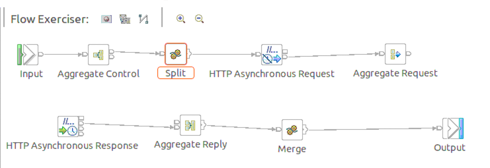{style="width: 500px;height: 150px;"}

[ ]

By default, the node clears the output message buffer and reclaims the
memory when the PROPAGATE statement completes. The PROPAGATE ... DELETE
NONE will not delete the Message Assembly/Logical Tree after propagating
so that the message is available for routing to the next destination.
Use DELETE NONE if you want the downstream nodes to be able to see a
single instance of output local environment message, and exception list
trees.

[ ]

Propagation is a synchronous process. That is, the next statement
(incrementing the counter in our example) is not executed until all the
processing of the message in downstream nodes has completed. So that
means the counter 'I' will be incremented after the
[[http://localhost:7080/legacybackendservice/v1/customer/Amit]](http://localhost:7080/legacybackendservice/v1/customer/Amit)
web service response is sent to the AggregateReply.

After the while loop completes the return false command is run. This
exits the code immediately. Only now will the flow pass on to the
AggregateReply node.

[ ]

The AggregateReply node creates a folder in the combined message tree
below Root, called ComIbmAggregateReplyBody. Below this folder, the node
creates a number of subfolders using the names that you set in the
AggregateRequest nodes. These subfolders are populated with all
associated reply messages.

[ ]


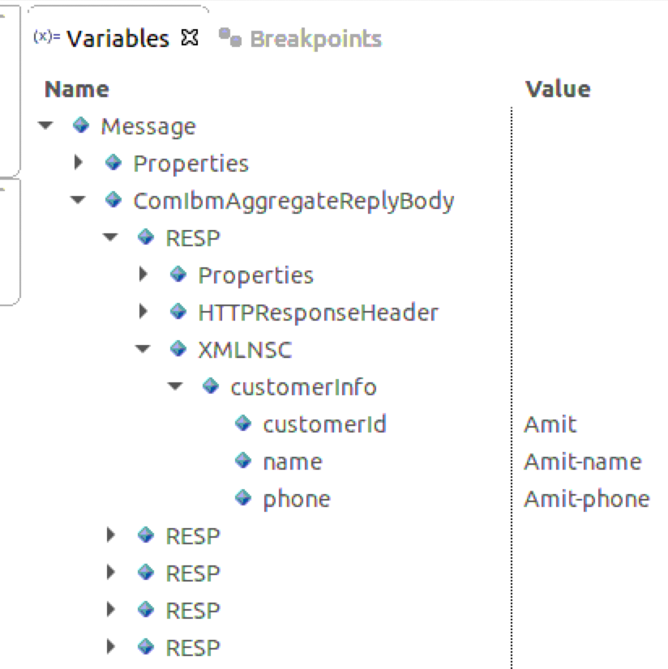{style="width: 500px;height: 500px;"}

AggregateControl, AggregateRequest nodes (Used in Fan-Out to broadcast
the request message to multiple destinations). The request node records
the number of requests.

[ ]

AggregateReply (Used in Fan-In to collect responses) -- checks if all
responses are collected.

[ ]

'Aggregate Name' property of AggregateControl & AggregateReply nodes
should be the same. Our Aggregate Control & AggregateReply nodes have an
Aggregate name AGGR.

[https://ibmintegrationbus.wordpress.com/2019/06/14/aggregation-nodes/[]{.s15}](https://ibmintegrationbus.wordpress.com/2019/06/14/aggregation-nodes/)

[ ]

The 'Folder Name' property of the AggregateRequest node decide how the
input will be structured in Fan-Out flow. We are using RESP. RESP will
be an array for multiple responses.

[ ]

It combines the generation and concurrent fan-out of a number of
related requests with the fan-in of the corresponding replies, and
compiles those replies into a single aggregated reply message. IIB as a
product makes it easy to implement complex integration scenario with
Aggregation support.

[ ]

FanOut flows: AggregateRequest and AggregateControl (whenever we use
Aggregation control, we must use Aggregation request)

FanIn flow: AggregateReply (it will club the incoming multiple
responses) from AggregateControl node and AggregateRequest node.

[ ]

Reference:
[[https://community.ibm.com/community/user/integration/viewdocument/ibm-integration-bus-for-developers?CommunityKey=77544459-9fda-40da-ae0b-fc8c76f0ce18&tab=librarydocuments]{.s17}](https://community.ibm.com/community/user/integration/viewdocument/ibm-integration-bus-for-developers?CommunityKey=77544459-9fda-40da-ae0b-fc8c76f0ce18&tab=librarydocuments){.s16}

[ ]

# SAP

[\*\* \*\*]

[Connecting to Enterprise Information
Systems[]{.s15}](https://www.ibm.com/docs/en/app-connect/12.0?topic=applications-connecting-enterprise-information-systems)

[]WebSphere Broker Adapters Transport is a service that connects to
EIS (such as SAP). To use the transport, your message flow must contain
one or more WebSphere Adapter nodes, for example the SAPRequest node
(needs an outbound adapter component, which is used by the message flow
to invoke a service in the EIS).

With the adapter for SAP software you can create integrated processes
that include the exchange of information with an SAP server, without
special coding. The adapter creates a standard interface to the
applications and data on the SAP server so that the developer of the
application component does not have to understand the lower-level
details (the implementation of the application or the data structures)
on the SAP server. The adapter complies with the Java Connector
Architecture (JCA) 1.5, which standardizes the way in which application
components, app servers, and EIS, interact with each other.

SAPRequest node -> sends a request to SAP which will then call up to
the BAPI (Business Application Programming Interface). BAPI is a
function that SAP provides, in order to get access to the data. The
nodes also need XML Schema Definitions (XSD) to ensure that ACE messages
are propagated to and from nodes reflect the logical structure of the
data in the EIS.

# How to use IBM App Connect with SAP (via RFC)

[Connecting to SAP (via
RFC)[]{.s15}](https://www.ibm.com/docs/en/app-connect/12.0?topic=hga-sap-via-rfc#index__connect__title__1)

When you double click say a SAPRequest node an Adapter component
selection window appears. Then click on import where you create your own
adapter. To connect to SAP you need a connector file. Adapter for SAP
Software is packaged and delivered as two RAR files, and the one you use
depends on whether the invoked SAP function supports transactional
behavior.

If the targeted function (for example, BAPI) supports transactions, use
the CWYAP_SAPAdapter_Tx.rar adapter because it supports local
transaction behavior and, as such, can participate in the transaction
managed by the WebSphere Application Server Transaction Manager.

If the targeted function (for example, BAPI) does not support
transactions, use the CWYAP_SAPAdapter.rar adapter because it indicates
to the WebSphere Application Server Transaction Manager that the
interaction performed with the SAP system cannot participate in and
follow transactional semantics.

You will need to contact your administrator for the SAP client files (Go
to the SAP Support Portal and download the SAP Java™ Connector and the
SAP Java IDoc Class Library, which together contain the following files:
**sapjco3.jar, libsapjco3.so, sapidoc3.jar**) as well as for the
connection details for how to connect to SAP (hostname or IP address of
the SAP system, two-digit system number of the instance that you want to
access in the SAP system; for example, 00, three-digit number of the
client that you want to access within the SAP instance; for example,
110, ISO two-letter case-insensitive code that identifies the language
setting of the SAP system; for example, en or EN, code page, username,
password) & to find out which BAPIs you will need to be invoking.
WebSphere Adapter for SAP Software connects to SAP systems running on
SAP Web application servers. The adapter supports Advanced Event
Processing (AEP) and Application Link Enabling (ALE) for inbound
processing, and the Business Application Programming Interface (BAPI),
AEP, ALE, and Query Interface for SAP Systems (QISS) for outbound
processing. You set up the adapter to perform outbound and inbound
processing by using the Adapter Connection wizard to generate business
objects based on the services it discovers on the SAP server.

For outbound processing, the adapter client invokes the adapter
operation to create, update, or delete data on the SAP server or to
retrieve data from the SAP server.

For inbound processing, an event that occurs on the SAP server is sent
from the SAP server to the adapter. The ALE inbound and BAPI inbound
interfaces start event listeners that detect the events. Conversely, the
Advanced event processing interface polls the SAP server for events. The
adapter then delivers the event to an endpoint, which is an application
or other consumer of the event from the SAP server.

You configure the adapter to perform outbound and inbound processing by
using the Adapter Connection wizard to create a library that includes
the interface to the SAP application as well as business objects based
on the functions or tables that it discovers on the SAP server. In the
wizard we can add a filter to the RFC search results. For example find
objects with this pattern BAPI_CUSTOMER\*. We create the adapter in the
library because the library will remain constant even if we regenerate
the pattern (https://www.youtube.com/watch?v=4r6gNuE-6is 5:50). We name
the library say ContactBook_ProcedureHandlers. It will contain CRUD
subflows. Finally in the properties tab at the bottom of the page set
the default setting to GetDetail2 as this is the read procedure. Under
the ContactBook_ProcedureHandlers library is a schema definitions
folder. We open the data model for GetDetail2. This XSD is quite complex
but WMB simplifies this by using the transformation functions. Drag a
Compute node between Input and ReadCustomer in the sub-flow. This
Compute node will build the request message to be sent to the SAPRequest
node
https://www.ibm.com/docs/en/app-connect/12.0?topic=scenarios-migrating-sap-integration-flow.

When you create a SAPRequest node has a Response Message Parsing
properties. The Message domain property specifies the domain that is
used to parse the response message. The DataObject domain is the default
domain when parsing messages that are produced by the SAPRequest node.
**DataObject domain. You cannot specify a different domain**. The node
automatically detects the message type.

A DataObject is typically used with the Clipboard and in drag-and-drop
operations. The DataObject class provides the recommended implementation
of the IDataObject interface. It is suggested that you use the
DataObject class rather than implementing IDataObject yourself. Multiple
pieces of data in different formats can be stored in a DataObject. Data
is retrieved from a DataObject by its associated format. Because the
target application might not be known, you can increase the likelihood
that the data will be in the appropriate format for an application by
placing the data in a DataObject in multiple formats.

However, when passing data to the SAPRequest node (for example, by using
an MQInput node), the use of a different domain can improve performance.
For example, use the XMLNSC parser with the MQInput node to parse XML
messages.
