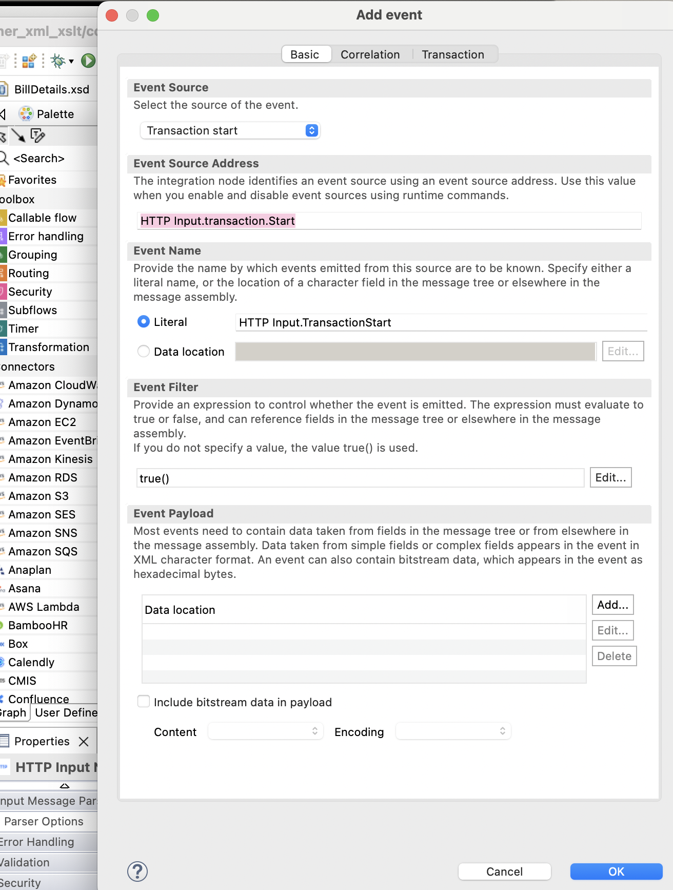
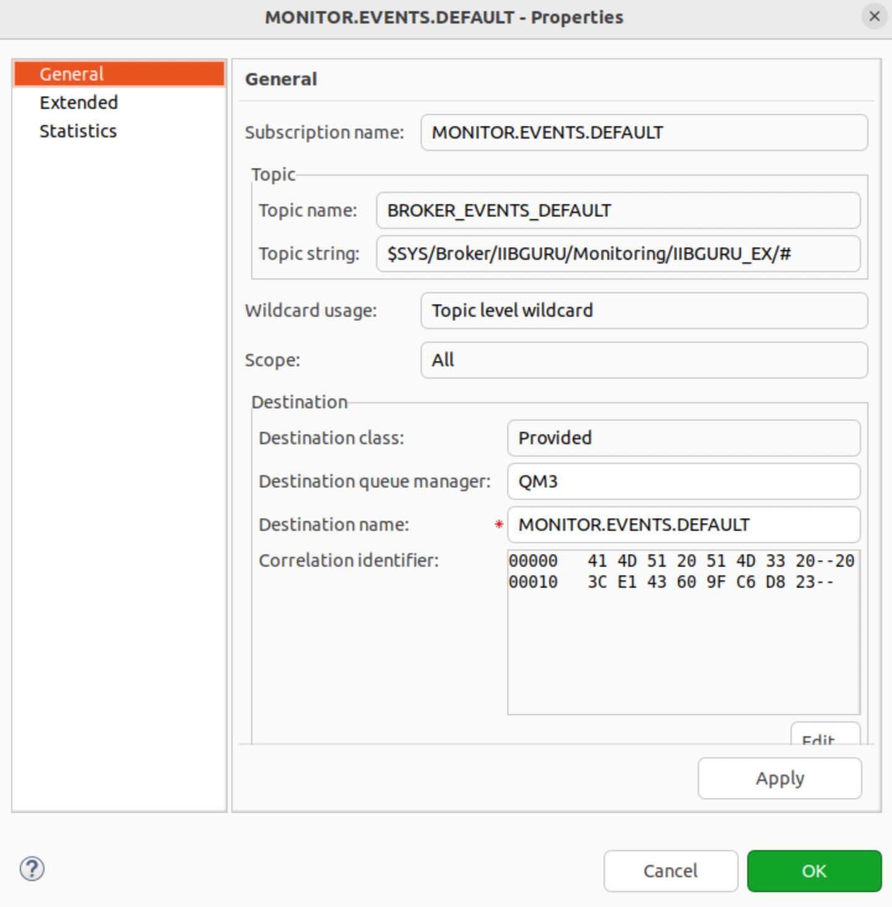

<!-- START doctoc generated TOC please keep comment here to allow auto update -->
<!-- DON'T EDIT THIS SECTION, INSTEAD RE-RUN doctoc TO UPDATE -->
**Table of Contents**  *generated with [DocToc](https://github.com/thlorenz/doctoc)*

- [Event Monitoring](#event-monitoring)
- [Event Monitoring using node properties](#event-monitoring-using-node-properties)
- [Event Monitoring using monitoring profile XML file](#event-monitoring-using-monitoring-profile-xml-file)

<!-- END doctoc generated TOC please keep comment here to allow auto update -->

# Event Monitoring

You can configure events by using either of the following
methods:

- Use the Flow Editor in the IBM App Connect Enterprise Toolkit to
  configure the message flow monitoring events.
- Use a Monitoring profile to define monitoring events that can be
  applied to one or more message flows that are deployed to an
  integration server. A Monitoring profile is a special XML file that is
  stored and deployed in a Policy project.

# Event Monitoring using node properties

[Monitoring using Node Property](https://youtu.be/Be92ez0wtSA?si=zB1o5WWxInExQNJB)
Feature in IIB where we can log some events. These can be categorized as Transactional or
Terminal (node terminal). For example, the HTTP Input node has a
Monitoring tab under properties. This will allow the node to produce
events as messages are processed. Events are published as XML messages
that can be subscribed to by other IIB applications. The messages can
capture message performance and stats.



You can map some key fields from the XML data to a custom app. This
data is typically inserted into a database in PROD.

You first have to create an MQ queue called MONITOR.EVENTS.DEFAULT.
Then create a topic called BROKER_EVENTS_DEFAULT with a Topic String

```
$SYS/Broker/TESTNODE/Monitoring/TESTEG/<flowname>
```

For an MQ pub/sub broker, the topic root is $SYS/Broker. For
example,

```
$SYS/Broker/integrationNodeName/Status/ExecutionGroup/integrationServerName]
```

The Topic String is where the event message is going to be put to.
Instead of \<flowname> you can enter the # symbol for
all flows. Create an MQ subscription called MONITOR.EVENTS.DEFAULT and
select the Topic you just made as well as the queue manager and the
queue you just made since you want to receive these publications on an
MQ queue.



Then configure and enable event monitoring on a message flow. Your
event source could be a Transaction start on an HTTP Input node or the
end on an HTTP Output node. This information allows us to capture and
report message flow performance.

Activate broker monitoring events using:

```
$ mqsichangeflowmonitoring IIBGURU -e IIBGURU_EX -k EvalEmp -f EVAL.PROC.EvalProc -c active
# BIP8071I: Successful command completion.

$ mqsireportflowmonitoring IIBGURU -e IIBGURU_EX -k EvalEmp -f EVAL.PROC.EvalProc
# BIP8911I: Monitoring settings for flow 'EVAL.PROC.EvalProc' in integration server 'IIBGURU_EX' - State?: active
```

Since the flow is running on a broker that is linked to the queue
manager the monitoring is set up. Now when you send a message through
your EVAL.PROC.EvalProc flow the monitoring will be triggered to create
an event message in XML format on the queue
MONITOR.EVENTS.DEFAULT.

But before that you have to create a flow that will work with the event
message. This flow has an MQInput node that has the queue name set to
MONITOR.EVENTS.DEFAULT. Then the XML will be passed to the next node to
insert into the database.

# Event Monitoring using monitoring profile XML file

[Using Monitoring Profile](https://youtu.be/qZN9zq6h1a8?si=wtlpvpUR4BnBk8NY)
A monitoring profile XML file lists the event sources in the message flow that emits events,
and defines the properties of each event. You then deploy or redeploy a
monitoring profile in a Policy Project. After you create and deploy a
monitoring profile, apply it to one or more message flows and then
activate monitoring for the flows.

A monitoring profile is an XML document that specifies the event
sources in a message flow that emits events, and the properties of those
events. The monitoring profile XML must conform to the XML schema file
MonitoringProfile.xsd, which you can find in the samples directory of
your IBM® App Connect Enterprise installation:
Install_root/server/sample/Monitoring/MonitoringProfile.xsd

[← Back to Main page](../IIB_ACE.md)