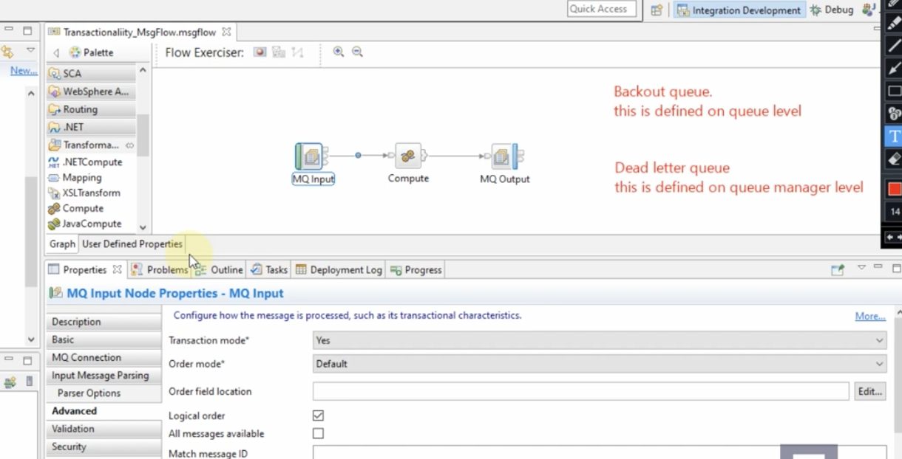
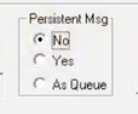

<!-- START doctoc generated TOC please keep comment here to allow auto update -->
<!-- DON'T EDIT THIS SECTION, INSTEAD RE-RUN doctoc TO UPDATE -->
**Table of Contents**  *generated with [DocToc](https://github.com/thlorenz/doctoc)*

- [MQInputNode mode. How your messages will be processed](#mqinputnode-mode-how-your-messages-will-be-processed)
- [MQOutputNode mode. How your messages will be processed](#mqoutputnode-mode-how-your-messages-will-be-processed)
- [Scenario full queue MQOutputNode node](#scenario-full-queue-mqoutputnode-node)
- [MQ Output](#mq-output)
- [MQ Reply](#mq-reply)
- [Publication Node](#publication-node)
- [MQRFH2 Tree](#mqrfh2-tree)

<!-- END doctoc generated TOC please keep comment here to allow auto update -->

# MQInputNode mode. How your messages will be processed



[Transaction Mode of MQ Input Node (Part1)](https://youtu.be/QGp83DeRoUs?si=BA8Iz6zAcy9FryfA)
Under Properties then Advanced there is a Transaction mode which relates to how your messages
are going to be processed.

This could be Yes (message is received but if there is an exception the
original message will go to a backout queue; which if defined is at the
queue level or DLQ; defined at QMGR level else it will loop), No or
Automatic. Imagine there is a problem in the compute node or suppose the
queue on the MQ output has a problem then the flow returns the message
to the MQInput node. If the IN queue has a backout queue defined the
message ends up on it. If not defined, then it goes to DLQ defined at
QMGR level.

If no DLQ then **continuous** loop. If while it loops I define a DLQ for
the QMGR then looping stops as the message goes to the DLQ.

If a DLQ or backout queue is defined but I change the Default
persistence of the IN queue to Not persistent then the message is
discarded.

If a DLQ or backout queue is defined but I change the Default
persistence of the IN queue to Persistent then the message is discarded
if the sending application has set persistence to No thereby overriding
the queue setting.

An exception could occur if the wrong data source is defined at the
Compute Node in between the MQInputNode and MQOutputNode. The
MQInputNode has a Basic tab under properties which has a Queue Name
field. If say IN.LQ is the value of that field then you need to define
the backout queue for that queue using MQ Explorer.

# MQOutputNode mode. How your messages will be processed

[Transaction Mode of MQ Output](https://www.youtube.com/watch?v=DiTdocdPc9w)

If the Transaction mode is Automatic then it will inherit from the MQInput node.

If the Transaction mode is Yes then it will wait for the whole flow
(Transaction) to complete before the MQPUT results in a message existing
on the output queue. The whole transaction is rolled back.

If the Transaction mode is No then it will NOT wait for the whole flow
(Transaction) to complete. The MQPUT will complete and a message put on
the output queue

# Scenario full queue MQOutputNode node

Look for "Resolving implementation problems when developing message
flows" in IBM's online ACE page. Then look for [Messages enter the
message flow but do not exit](https://www.ibm.com/docs/en/app-connect/13.0.x?topic=flows-resolving-implementation-problems-when-developing-message#au16530_2)

[DEC212020-IIB FixHTTPProdCon_ESQLThrow](https://drive.google.com/file/d/1-KG_swTi1BJSf9WFXBYR-PDvSR_UOSoV/view?usp=share_link)
33:52 minutes shows you how the flow looks.

> **_FUNDAMENTAL:_**  In a flow even if you have 30 nodes in a message flow, if any of the nodes throws an error, the transaction is rolled back to node 1 in your message flow.

When a rollback occurs the exception is in the ExceptionList tree at the end. If the first node's catch terminal is connected then the Message and ExceptionList trees are sent to the node connected to catch. That node could be a transaction node that reads the exception and maybe an MQOutput node that puts the message on a queue. That way the message is not lost.

If catch is not connected then it will try the Failure node. It will send the Message tree but not the ExceptionList. Instead of the ExceptionList it will send the default exception which will say "you did not handle the Catch terminal".

Another scenario is when the MQPUT command to the output queue that is defined on the MQOutput node may not successful because the queue is FULL. The Failure terminal of the MQInput node has not been
connected. Non-transactional messages are discarded. Whenever Transaction mode of the MQInput node is automatic, then transactionality is defined by persistence of the queue for the node. When queues are defined the Default persistence is 'Not Persistent'. 

So the behaviour is the same as when Transaction mode is 'No'. This means that, when the exception is not handled, the non-transactional messages are discarded.

When Transaction mode is Automatic and Default Persistance property on the IN queue is Persistent then (if DLQ on queue manager is defined) then the message persists to the DLQ.

Sometimes the app sending the message to the flow has a Persistent Msg setting:



If you select No then it will override the queues "Persistent" setting and the message is lost.

When the transaction mode setting for MQInput node is Yes, MQOutput
node is Automatic (transactionality derived from the Input node), Input
queue IN's Default persistence is Not persistent, OUT queue is same as
IN.

If I change the persistence to Persistent for the OUT queue, it makes no
difference so I reverted. If I change the persistence to Persistent for
the IN queue then I see in the syslog:

```
"BIP2643W: Unable to commit a WebSphere MQ transaction; MQCMIT
failed; queue manager=QM3, MQCC=1, MQRC=2003."

"BIP2648E: Message backed out to a queue; message flow node
'EsqlThrowStmt.MQ Input'."
```

The message has been backed out to the DLQ for the QMGR.

# MQ Output

[DEC292020-IIB Timeout_LabelRouting_MultiQueues](https://drive.google.com/file/d/1sJ3i-KQYDRGw1UG38bU05uUMFCe6r-Pa/view?usp=share_link)

You can send the message to multiple queues in ESQL. You need to change the Compute mode
to LocalEnvironment and Message in the Compute node properties as well
as the MQ Output's Destination mode to Destination List. Use the
command:

```
SET OutputLocalEnvironment.Destination.MQ.DestinationData[1].queueName='OUT';
SET OutputLocalEnvironment.Destination.MQ.DestinationData[2].queueName='OUT1';
```

# MQ Reply

[JAN042021-IIBFileNodeBARMQReplyTryCatchFlowOrder](https://drive.google.com/file/d/15EypxxgHztb_VdEnJa82vgmFoQO7wY7L/view?usp=share_link) 24 minutes. The client
system sets the name of the queue the flow has to reply to. RFHUTIL
allows you to set the ReplyTo header setting.

# Publication Node

This node handles publishing to the Topic within MQ. MQ can contain
subscriptions that will listen to what is published if the topic string
matches.

# MQRFH2 Tree

The MQRFH2 header is used to pass messages to and from an integration
node that belongs to IBM® Integration Bus. In a message, the MQRFH2
header follows the WebSphere® MQ message descriptor (MQMD) and precedes
the message body, if present.

What is the use of MQRFH2 header? You can pass application data to
__other__ flows if the protocol is MQ. In the example below
the MQ Output puts a message to a queue called test2. That then triggers
another message flow called SecondFlow.msgflow which has an MQ Input to
receive the message. You cannot use Environment.Variables.orderPerson
when traversing from FirstFlow.msgflow to SecondFlow.msgflow. So how can
you pass the data in Environment.Variables.orderPerson?

In the flow below the environmental variable is not available for the
"call Service" but is accessible from the compute nodes. The 'call
Service' contains:

```
SET OutputRoot.XMLNSC.ServiceResponse = InputRootXMLNSC.shiporder.shipto;
```

In the first flow: 

```
SET Environment.Variables.orderPerson = InputRoot.XMLNSC.shiporder.orderperson;
```

This variable is then needed in the second flow:

```
SET OutputRoot.MQRFH2.usr.oPerson = Environment.Variables.orderPerson;
```

Since the Compute1 node has an Out1 → HTTP Reply and Out → MQ Output
you need to construct a message for the tree that will go to HTTP Reply
& a different message tree that goes to MQ Output.

```
CALL CopyMessageHeaders();

DELETE FIELD OutputRoot.HTPResponseHeader;

SET OutputRoot.XMLNSC.Acknowledgement = 'Sent to Downstream';

PROPAGATE TO TERMINAL 'out1'; --this goes to the HTTP Reply which sends a response to the client that initiated the HTTP request
```
(FYI if you added DELETE NONE to the last ESQL it will not delete the
Message Assembly/Logical Tree after propagating)

------------ Second message assembly being constructed from scratch again

```
SET OutputRoot.Properties = InputRoot.Properties;
SET OutputRoot.MQMD = InputRoot.MQMD;
DELETE FIELD OutputRoot.HTPResponseHeader;
SET OutputRoot.MQRFH2.usr.oPerson = Environment.Variables.orderPerson;
SET OutputRoot.MQRFH2.usr.shipto = InputRoot.XMLNSC.ServiceResponse; -- this is the response from 'call Service'. This Input Assembly was object was constructed in the 'call Service'.

RETURN TRUE; -- by default means it will propagate to the OUT terminal so no need for an explicit propagate. To stop this default behaviour use RETURN FALSE
```

Once the 2nd message assembly reaches the 2nd flow via MQ protocol a new Output message assembly is created using the MQRFH2 header values.