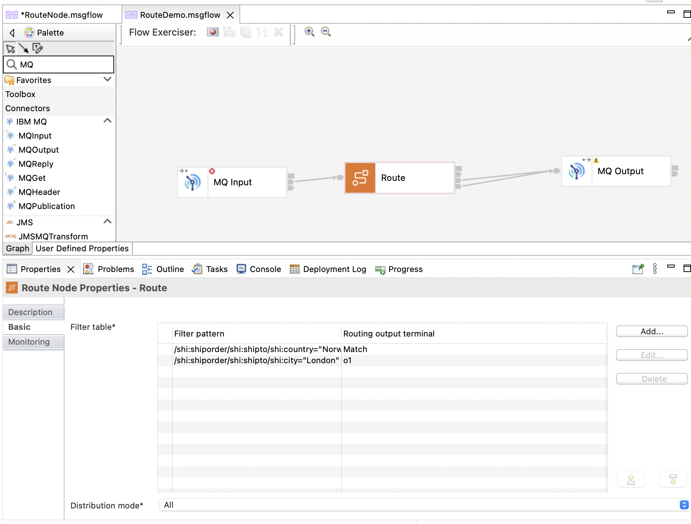
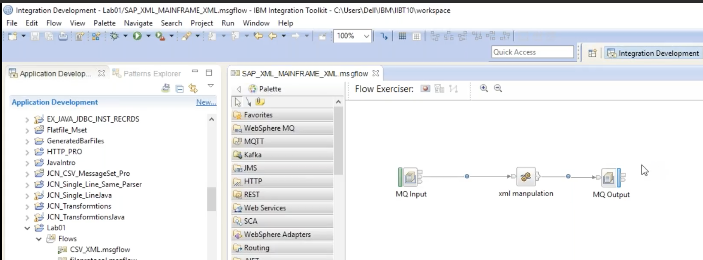

<!-- START doctoc generated TOC please keep comment here to allow auto update -->
<!-- DON'T EDIT THIS SECTION, INSTEAD RE-RUN doctoc TO UPDATE -->
**Table of Contents**  *generated with [DocToc](https://github.com/thlorenz/doctoc)*

- [Message Routing](#message-routing)
- [Route node](#route-node)
- [Filter node](#filter-node)
- [RouteToLabel node](#routetolabel-node)

<!-- END doctoc generated TOC please keep comment here to allow auto update -->

# Message Routing

Application A -XML-> ESB -> B (XML)

Application A -JSON-> ESB -> C (JSON)

Suppose you have a Route node preceding the RCD node. Within it you can
set XPaths. These are used to extract the header information. In the
Postman request you can set the content type to XML or JSON. Then the
XPath dictates which node to propagate to. It might send the message to
the RCD where the domain is set.

# Route node

The Route node does not support ESQL. The Filter, Compute and Database nodes do. The Route node uses XPaths to determine which developer-defined terminal to send the message via. If, for example, you have an XMLNSC payload in the Body, then deploy your app with a schema for that XML. Then the paths will match to the terminal. You can see this in a Filter table in the Basic properties. It's not just XSD. You can use any Message Model. The Distribution mode dictates whether all or just the First match must be met.



# Filter node

Use the Filter node with an ESQL statement to determine the next node
to which the message is sent by this node. Do not use the ESQL code that
you develop for use in a Filter node in any other type of node.

## Compute node vs Filter node

```
CREATE COMPUTE MODULE LoadGlobalCache_LoadCache
CREATE FUNCTION Main() RETURNS BOOLEAN
BEGIN

    IF(InputRoot.XMLNSC...

```
### Filter node
```
CREATE FILTER MODULE FilterNode_Filter
CREATE FUNCTION Main() RETURNS BOOLEAN
BEGIN

    IF(Root.XMLNSC...

```

The Filter node does not use InputRoot or OutputRoot. Only Root. It cannot make changes to the tree.
The 'RETURN TRUE' will go to this node's True terminal. But in Compute it will go to the Out terminal.
The 'RETURN FALSE' will go to this node's False terminal. But in Compute it will just stop.

# RouteToLabel node

The RouteToLabel node dynamically routes a message to a Label node in the message flow based on the content of the message's LocalEnvironment tree. It interrogates the LocalEnvironment to find the identifier of the destination Label node. This allows for flexible routing without needing physical connections to all possible Label nodes. 

## How it works
1. Populate the LocalEnvironment: Before the RouteToLabel node, a Compute or JavaCompute node is used to populate the LocalEnvironment with the identifiers of one or more Label nodes.
1. Dynamic Routing: When the message reaches the RouteToLabel node, it reads the identifiers from the LocalEnvironment and sends the message to the corresponding Label node.
1. Logical connection: A physical connection is not needed between the RouteToLabel node and the Label node; the broker makes the connection based on the data in the LocalEnvironment.
1. Label node's role: The Label node itself does not process the message. It simply acts as a target for the routing decision and is typically followed by a subflow or another sequence of nodes. 

Use the RouteToLabel node after a Compute node or a JavaCompute node for complex routing. Define a list of destinations in a Compute or JavaCompute node that are acted on by the RouteToLabel node. This node's properties have no significance since the LE dictates on the fly flow destination choices.
In order to understand this you need to understand the LocalEnvironment tree as the RouteToLabel node interrogates the destinations and passes the message on to the corresponding Label node using the LocalEnvironment tree.

>* NOTE
>* OutputLocalEnvironment is an editable tree. InputRoot is not

>* Reference
>* [DEC292020-IIB Timeout_LabelRouting_MultiQueues 34 minutes](https://drive.google.com/file/d/1sJ3i-KQYDRGw1UG38bU05uUMFCe6r-Pa/view?usp=share_link)
>* We can override most node properties with LE tree.
>* [Udemy Routing using RouteToLabel Node](https://www.udemy.com/course/ibm-integration-bus-with-practicals/learn/lecture/20708678#overview)
>* Search for Local enviornment tree structure in Infocenter.

## LocalEnvironment tree

It will consist of pre-defined variables and user-defined variables. So, either you can create your own variables or use pre-defined. The scope of the variables is only till the next node. In the flow below the variables are defined using ESL in the xml manipulation node. But the LE tree is only available till the MQ Output node. If there were nodes after the latter then they would not have access to that LE tree. In addition instead of using hard coded values in the MQ Output node's properties we can set the property values as defined in the LE tree.



[← Back to Main page](../IIB_ACE.md)