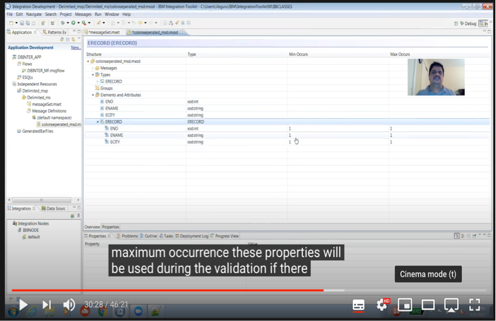
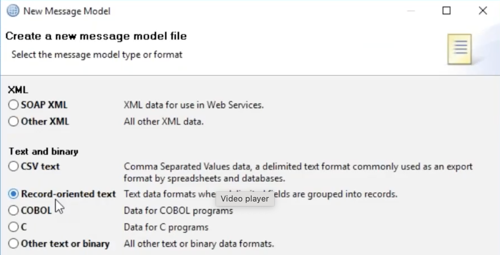
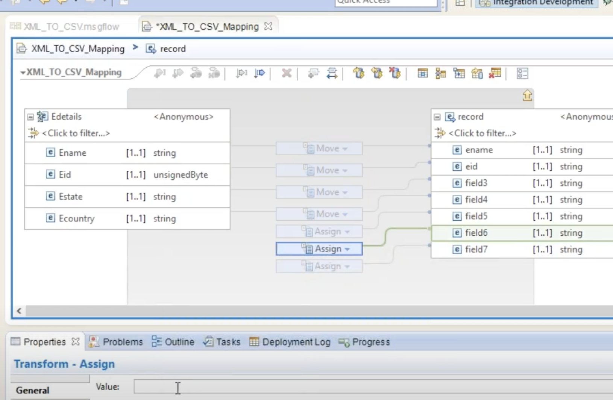

<!-- START doctoc generated TOC please keep comment here to allow auto update -->
<!-- DON'T EDIT THIS SECTION, INSTEAD RE-RUN doctoc TO UPDATE -->
**Table of Contents**  *generated with [DocToc](https://github.com/thlorenz/doctoc)*

- [Message Transformation](#message-transformation)
- [Transformation Extender](#transformation-extender)
- [Transformation using XSL in a message flow](#transformation-using-xsl-in-a-message-flow)
      - [Source](#source)
      - [Target](#target)
- [Message Enrichment](#message-enrichment)
- [Protocol conversion](#protocol-conversion)
- [SOA (Service Oriented Architecture)](#soa-service-oriented-architecture)
- [Message Set, Message definition creation](#message-set-message-definition-creation)
- [Message Set, Message definition creation for XML](#message-set-message-definition-creation-for-xml)
- [Message modelling](#message-modelling)
- [Mapping XML from an XSD](#mapping-xml-from-an-xsd)
- [Mapping XML with multiple records from an XSD](#mapping-xml-with-multiple-records-from-an-xsd)

<!-- END doctoc generated TOC please keep comment here to allow auto update -->

# Message Transformation

Application A produces XML format, but Application B accepts JSON

A -XML-> ESB -JSON-> B

Formats include XML, JSON, SOAP, CSV, TAG delimited.

# Transformation Extender

CloudPak is a pack made up of IIB, MQ, WTX, DataPower & API Connect.
WTX is coding free transformation but in IIB we can do transformation in
5 coding languages. Data transformation engine at the core of IBM TX.
Consider the following data stream for which ITX has an adapter Paul
Brett Operations 1/4/1970.
The data stream is read into a type tree. Consider this tree to be a
type of bucket. This bucket can hold further buckets. This can be
transformed into: Paul Brett Operations 1970-04-01.
The output adapter sends the XML to either MQ, a file or something else.
WTX protocol support is less.


# Transformation using XSL in a message flow

Use the XSLTransform node to transform an XML message to another form
of message, according to the rules provided by an XSL (Extensible
Stylesheet Language) style sheet, and to set the Message domain, Message
model, Message, and Physical format for the generated message.

Here is a sample XSL file. You can drag and drop the file onto the
Application in your toolkit. Then your XSL Transform node can reference
it in it's properties.

```
    <xsl:stylesheet version="1.0" xmlns:xsl="http://www.w3.org/1999/XSL/Transform"> 
    <xsl:output method="xml" indent="yes"/> 
     <xsl:template match="/"> 
      <xsl:element name="PrimeCustomer"> 
       <xsl:for-each select="shoppingCart/Customer">
         <xsl:element name="customer">
           <xsl:element name="ID"><xsl:value-of select="@ID"/></xsl:element>
           <xsl:element name="Amount"><xsl:value-of select="amount"/></xsl:element>
           <xsl:element name="paymentType"><xsl:value-of select="paymentType"/></xsl:element>
        </xsl:element>
       </xsl:for-each>
      </xsl:element>
     </xsl:template> 
    </xsl:stylesheet>
```

XSLT uses XPath to define parts of the source document that should
match one or more predefined templates. The value of the match attribute
of the <xsl:template> instruction must be a match pattern. / in XPath
denotes the root or document node. When a match is found, XSLT will
transform the matching part of the source document into the result
document.

#### Source

```
  <shoppingCart>
    <Customer ID="434">
    <amount>5600</amount>
    <paymentType>netbanking</paymentType>
    </Customer>
    <Customer ID="435">
    <amount>4580</amount>
    <paymentType>card</paymentType>
    </Customer>
    <Customer ID="436">
    <amount>2000</amount>
    <paymentType>netbanking</paymentType>
    </Customer>
    <Customer ID="437">
    <amount>5000</amount>
    <paymentType>card</paymentType>
    </Customer>
</shoppingCart>
```

#### Target

```
        <PrimeCustomer>
        <customer>
           <ID>434</ID>
           <Amount>5600</Amount>
           <paymentType>netbanking</paymentType>
        </customer>
        <customer>
           <ID>435</ID>
           <Amount>4580</Amount>
           <paymentType>card</paymentType>
        </customer>
        <customer>
           <ID>436</ID>
           <Amount>2000</Amount>
           <paymentType>netbanking</paymentType>
        </customer>
        <customer>
           <ID>437</ID>
           <Amount>5000</Amount>
           <paymentType>card</paymentType>
        </customer>
     </PrimeCustomer>
```

As of August 2022, the most recent stable version of the language
is XSLT 3.0. The correct way to declare an XSL style sheet according to
the W3C XSLT Recommendation is:

```
<xsl:stylesheet version="1.0"\
xmlns:xsl="http://www.w3.org/1999/XSL/Transform">
```

The "xmlns:xsl="http://www.w3.org/1999/XSL/Transform" points to
the official W3C XSLT namespace. If you use this namespace, you must
also include the attribute version="1.0".

# Message Enrichment

Application A -Hi-> ESB (adds 'how are you?') -> B (Hi how are
you?)

# Protocol conversion

Protocols (MQ, File, http, SOAP, SMTP, POP3, JMS, SFTP)
[Application A -HTTP-> ESB (HTTP to FTP) -> B (FTP)]

# SOA (Service Oriented Architecture)

Reusable service, loosely coupled, independent SOAP API based on XML.
REST API based on JSON

# Message Set, Message definition creation

> Reference [IIB Message set, Message Definition creation](https://youtu.be/ZC_uDGzhKIs?si=Bz4sfjpp9vF-Wpbs) & [Udemy Section 15:60](https://www.udemy.com/course/ibm-integration-bus-with-practicals/learn/lecture/28717792#overview).

For XML and JSON Message Modelling is optional. But for CSV, Flatfile,
EDI, HL7, SWIFT, COBOL etc it is mandatory. Message model schema files
are the preferred way to model messages for most data formats. How are
you going to create these and implement them as part of the message
flow? A request or response message needs to be defined. What are the
individual fields or field values contained therein? Parsing is
segregating the different parts of the message and interpreting what
each part means.
A message set can contain 1 or more message definitions. A message set
has a unique ID.


The message definition defines the field names, data types, delimiters.
This definition helps with say a message transformation. Consider the
following data 123:raju:detroitCRLF.
The carriage return, line feed can be seen in Notepad Plus Plus. CRLF
appears in Windows, LF appears if created in Linux.
In IIB Toolkit go to New -> Other -> Message Set. Give it a name of
Delimited_ms, give Delimited_msp for the project name. Click next then
select the type of message data most appropriate. We choose Text data.
Take a note of the next windows message domains (MRM which is the
default), wire formats (Text1), and Schemas (None). You will see your
newly created messageSet. Change the default wire format to Text1.

Remember message set ID is different from MQ message ID. The latter is
an MQMD (message queue message definition)
property.

You then right click on Message definition -> New -> Other -> Message
definition -> Message Definition File.
Click Next and name the file colonseparated_msd. Right click on Elements
and Attributes -> create Global element (lowest level).
The 3 fields combine to make a single record. That record should be
given a name and the name added to Types. Add it as a Complex type. In
order to tell IIB that ERECORD is a composite of the 3 fields right
click on ERECORD then Add Element Reference.



You need to go to Properties of ERECORD then select all elements
delimited then add colon for delimiter. When you test this using
MQInputNode you need to set the correct wire mode else you will get
"Invalid Wire format retrieved". This message is a sign that you have
not given Broker the correct definitions for it to interpret the text
received.
We need the message definition we created to be referenced correctly in
the MQInputNode -> Input Message Parsing. Under Message model it should
show you the message set but it does not unless you let the application
have access to the MS which is an independent resource. You need to
change the applications properties -> Project References -> Choose
Delimited_msp. NOW you can select Delimited_ms in the Input Message
Parsing. This also allows you to select ERECORD as the Complex message
definition. Physical format is the Text1 wire format.
When you see the Variables under the running thread you will not see the
ERECORD Complex type since it has been replaced by the MRM. Any
top-level Complex type of a text delimited message definition is going
to become MRM. You will see the children of MRM (ENO,ENAME,ECITY).

# Message Set, Message definition creation for XML

Message set will only tell you the format. But the actual schema XSD
will be in the Message definition. In the New Message Set wizard after
giving the message Set and project names click Next. Then choose "XML
documents" as the type of message data then Next. Wire formats is None
and Schemas are None. As ever the next step is to create some message
definitions in the same message sets. You can create them from XSD
files.

# Message modelling

[JAN192021-IIB JCN_ForLoop&JDBC&ModellingPt1 18 minutes](https://drive.google.com/file/d/1dm5ErDsUbQ80Ln-EGWGrCF6UABv85uNE/view?usp=share_link). The modelling
of a message can be achieved in the message set and definition as above
or within an IIB Message Model as introduced in version 8. You can
reference the Message Set and one of it's Definition objects in code.
The Message Model is the more advanced concept over Message Set and
Definition because you can test your model including performance without
deployment ('Test Parse Model' in the model xsd window JAN212021-IIB
ModellingPt2&Mapping). For example, you can model a CSV file. The model
should be in a container like a library or an application.

DFDL is a more advanced version of MRM. If you model the data using the
Message Set and message definition, then the parser is MRM. However, if
you model your data using the Message Model then the parser is DFDL.
Refer to 14DEC2020-IIBMSetMDef.mp4 27:24 and
IBM/IIBT10/workspace/MindMajix/David/CSV_XML_MessSetDEMO_MF_Compute.esql

In your MQInput node there is an Input Message Parsing tab. When you
are expecting MRM, you need a Message value of say {}:IN. This is in
your Message definition. You will see this appear as MessageType in your
Message -> Properties in debug. If you want to convert from, say XML,
to CSV you cannot set the MQInput node properties in the MQOuput node.
You need a Compute node with this:

```
SET OutputRoot.Properties.MessageSet='csvSingleLine';
SET OutputRoot.Properties.MessageType='{}:TargetMessag';
SET OutputRoot.Properties.MessageFormat='Text_CSV';
```

If your incoming data contains a header and a trailer, then use
record-oriented text and select 'The first record is a header' in the
wizard.



[JAN212021-IIB ModellingPt2&Mapping 12 minutes](https://drive.google.com/file/d/1ESpoPURJo-q4rYdCjFCHWRGS9_VoTbJ8/view?usp=share_link). We saw the
transformations with ESQL and the JCN. If you don't want to write a
single line of code, then the mapping transformation node helps.
However, you cannot do complex transformation using the mapping node.
You can only do minimal types of transformations like converting XML to
JSON, fields mapping, string values or static values.

You can refer to Message Models in a Mapping node. But the Mapping node
cannot reference an existing message set/definition

Another fundamental point is that generally for XML & JSON 99% of the
time we don't model since the description of what the data values mean
is already defined (for example Edetails.xsd). But, if you are planning
on doing the transformation using the mapping node, then you need to
model the data in a Message Model, even if that data is XML or
JSON.

When you send CSV data set the Content-Type to text/csv in the Postman
client. You might have a parsing issue depending on whether the text
file has CR & LF at the end of the line (windows) or just LF (Unix,
macOS). You can run xxd - make a hex dump or do the reverse (reference:[Linux Tips and Tricks - Line Feed and Carriage Returns]
(https://youtu.be/VRwFvt5eHeA?si=X3LOsTz6fdPoQrQS) e.g. 'xxd
Bill_Piped_delim.csv'. If your file does not have CR then remove CR
from the sequence in the Message Model. Reference:
[iib - convert csv to xml  15:32](https://youtu.be/qXwYJGsgw8c?si=ahdxMt1nlHJ6tVI4). I can use 'od
-c filename' in order to see the escape characters. Remember that \\n is a line feed.

# Mapping XML from an XSD

[JAN212021-IIB ModellingPt2&Mapping 16 minutes](https://drive.google.com/file/d/1ESpoPURJo-q4rYdCjFCHWRGS9_VoTbJ8/view?usp=share_link). The
IBM/IIBT10/workspace/LIB_MODEL/Edetails.xsd file models the data for the
incoming XML. It is generated online using an existing XML file as a
template. The XSD file validates the XML and also speeds up development
of your integration applications by enabling ESQL content assist and
graphical maps.

The MAP_PRO application references the LIB_MODEL we created. When we
create a new message model file from the Edetails.xsd file we import it
into our workspace library LIB_MODEL.

When we double click on the mapping node a wizard opens. We choose the
'Edetails' model as the map inputs and the 'csvone' model as the map
outputs. Click next then choose DFDL as the output domain. This is
correct since we created 'csvone', using DFDL.

The graphical map opens up.



The root of the left XML message assembly is Edetails. The Edetails
[1..1] tells us there is at least one details group. The input XML
looks like this.

```
<Edetails>
  <Ename>David</Ename>
  <Eid>478</Eid>
  <Estate>Juhu</Estate>
  <Ecountry>IN</Ecountry>
</Edetails>
```

The fields [1..1] means there must be at least one occurrence in the
output assembly. But the input assembly does not move any values to
those fields. That is why we Assign a dummy value in the Assign
Properties -> General -> Value field.

# Mapping XML with multiple records from an XSD

[JAN192021-IIB JCN_ForLoop&JDBC&ModellingPt1](https://drive.google.com/file/d/1dm5ErDsUbQ80Ln-EGWGrCF6UABv85uNE/view?usp=share_link). You can edit your
mapping so that it has different map inputs and outputs. You can delete
the existing input/output using the red cross. From this XML we modelled
mulxml.xsd.

```
<Empdetail>
  <Emp>
    <Ename>David</Ename>
    <Eid>478</Eid>
    <Estate>Juhu</Estate>
    <Ecountry>IN</Ecountry>
    <Eage>35</Eage>
    <Egend>m</Egend>
    <Edoj>1222</Edoj>
  </Emp>
  <Emp>
    <Ename>Amit</Ename>
    <Eid>3269</Eid>
    <Estate>Osterley</Estate>
    <Ecountry>UK</Ecountry>
    <Eage>52</Eage>
    <Egend>m</Egend>
    <Edoj>1217</Edoj>
  </Emp>
</Empdetail>
```

[JAN212021-IIB ModellingPt2&Mapping 35 minutes](https://drive.google.com/file/d/1ESpoPURJo-q4rYdCjFCHWRGS9_VoTbJ8/view?usp=share_link). Since both the XML and
CSV model are multiple records, you go with the For Each in the Mapping
GUI.

[← Back to Main page](../IIB_ACE.md)