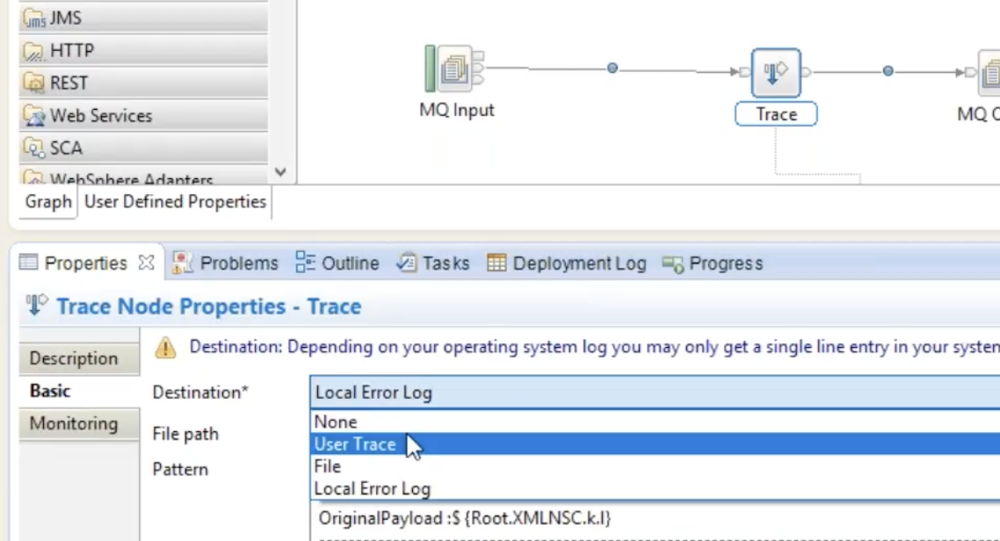

<!-- START doctoc generated TOC please keep comment here to allow auto update -->
<!-- DON'T EDIT THIS SECTION, INSTEAD RE-RUN doctoc TO UPDATE -->
**Table of Contents**  *generated with [DocToc](https://github.com/thlorenz/doctoc)*

- [Monitoring and Troubleshooting](#monitoring-and-troubleshooting)
  - [Trace Node](#trace-node)
- [Validation settings for input type nodes](#validation-settings-for-input-type-nodes)

<!-- END doctoc generated TOC please keep comment here to allow auto update -->

# Monitoring and Troubleshooting

In IBM App Connect Enterprise (ACE), Activity Logs, Resource Statistics, Trace, and Business Transaction Monitoring (BTM) are distinct tools used for different aspects of monitoring and troubleshooting, primarily differing in their level of detail and purpose. 

<table>
  <tr>
    <th style="background:#dbeafe;">Feature</th>
    <th style="background:#d1fae5;">Activity Logs</th>
    <th style="background:#fde68a;">Resource Statistics</th>
    <th style="background:#fbcfe8;">Trace (User/Service)</th>
    <th style="background:#c7d2fe;">Business Transaction Monitoring (BTM)</th>
  </tr>

  <tr>
    <td style="background:#f0f9ff;"><strong>Purpose</strong></td>
    <td>High-level overview of message flow interactions with external resources for initial investigation.</td>
    <td>Quantitative data on performance and resource usage of integration servers (CPU, memory, sockets, etc.).</td>
    <td>Detailed, step-by-step recording of internal processing within a message flow for deep debugging.</td>
    <td>End-to-end tracking of a specific business process across multiple systems and stages.</td>
  </tr>

  <tr>
    <td style="background:#f0f9ff;"><strong>Data Type</strong></td>
    <td>Concise, user-focused log entries about specific events.</td>
    <td>Numerical metrics and statistics reported at intervals (e.g., every 20 seconds).</td>
    <td>Very verbose, detailed sequence of events and data manipulations.</td>
    <td>High-level business events showing transaction state and timing.</td>
  </tr>

  <tr>
    <td style="background:#f0f9ff;"><strong>Verbosity</strong></td>
    <td>Low to medium.</td>
    <td>N/A (quantitative data).</td>
    <td>Very high (can impact performance).</td>
    <td>Medium (focused on business events).</td>
  </tr>

  <tr>
    <td style="background:#f0f9ff;"><strong>When to Use</strong></td>
    <td>First point of investigation when something unexpected happens, e.g. a connection issue.</td>
    <td>Ongoing performance monitoring and bottleneck detection.</td>
    <td>Deep-dive debugging of application logic or internal errors.</td>
    <td>Tracking critical business operations and their states across the enterprise.</td>
  </tr>

  <tr>
    <td style="background:#f0f9ff;"><strong>Activation</strong></td>
    <td>Enabled by default; configurable with policies.</td>
    <td>Must be explicitly enabled (not active by default).</td>
    <td>Must be explicitly started and stopped (can impact performance).</td>
    <td>Configured in the message flow using monitoring events and definitions.</td>
  </tr>
</table>

In short:
Activity Logs tell you if your flow talked to a database successfully or failed to connect.
Resource Statistics tell you how much CPU and memory your integration server is using.
Trace tells you exactly what line of code or internal step your message flow was executing when a problem occurred.
BTM tells you the overall progress and status of a complete business operation, like an order processing from start to finish, across all involved systems. 

## Trace Node

This is the default logging mechanism in IIB. In the Trace node there are 3 types of trace destination.



__File__

You enter the <path>/<file>. Then you give the pattern made up of user text and ESQL expressions in curly braces. ${Root} is the entire message tree.
```
Message Tree ${Root}
-----------------------
OriginalPayload :${Root.XMLNSC.k.l}
-----------------------
```

You could MQPUT XML on the IN queue:
```
<k><l>welcome</l></k>
```
The disadvantage is that you cannot switch off the file trace on the fly and the destination file will increase in size taking up PROD disk space. Because of this disk space issue the User Trace comes into the picture.

__User Trace__

No need for a file path since the trace events are going to the broker memory then whenever required we can download those logs.
```
mqsichangetrace IIBGURU -e IIBGURU_EX -u -l debug -f myMsgFlow // switches it on. The -u means user trace
mqsireadlog IIBGURU -e IIBGURU_EX -u -o usertracelog.txt // This downloads the logs
mqsiformatlog -i usertracelog.txt -o usertracelog.xml // change to XML format
mqsichangetrace IIBGURU -e IIBGURU_EX -u -l none
```
[DEC302020-IIB RoutingTryCatchTrace 28 minutes](https://drive.google.com/file/d/1OtA5Kyv5lCXJLzgyIIjcrndxdXGaKBOM/view?usp=share_link) Logs all validation
failures to the user trace, even if you have not asked for user tracing
of the message flow. Use this setting if you want processing of the
message to continue regardless of validation failures.

**Local Error Log**

Logs all validation failures to the error log (for example, the Event
Log on Windows). Use this setting if you want processing of the message
to continue regardless of validation failures.

# Validation settings for input type nodes

**Exception**

The default value. An exception is thrown on the first validation
failure encountered. The resulting exception list is shown below. The
failure is also logged in the user trace if you have asked for user
tracing of the message flow, and validation stops. Use this setting if
you want processing of the message to halt as soon as a failure is
encountered.

**Exception List**

Throws an exception if validation failures are encountered, but only
when the current parsing or writing operation has completed. The
resulting exception list is shown below. Each failure is also logged in
the user trace if you have asked for user tracing of the message flow,
and validation stops. Use this setting if you want processing of the
message to halt if a validation failure occurs, but you want to see the
full list of failures encountered. This property is affected by the
Parse Timing property; when partial parsing is selected the current
parsing operation parses only a portion of an input message, so only the
validation failures in that portion of the message are reported.

[← Back to Main page](../IIB_ACE.md)