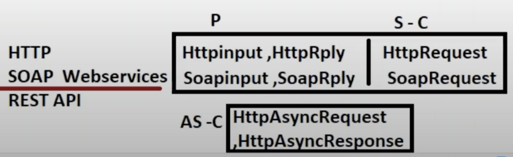
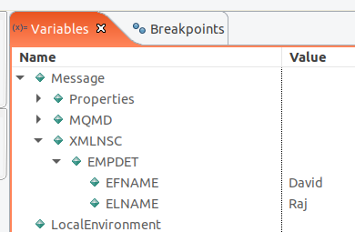

<!-- START doctoc generated TOC please keep comment here to allow auto update -->
<!-- DON'T EDIT THIS SECTION, INSTEAD RE-RUN doctoc TO UPDATE -->
**Table of Contents**  *generated with [DocToc](https://github.com/thlorenz/doctoc)*

- [Web Services](#web-services)
- [SOAP Gateway mode](#soap-gateway-mode)
- [Exposing SOAP webservice. WSDL creation](#exposing-soap-webservice-wsdl-creation)
- [REST](#rest)

<!-- END doctoc generated TOC please keep comment here to allow auto update -->

# Web Services

[Synchronous versus Asynchronous](https://youtu.be/N5Ky-mz6n-8)



SOAP is only XML, but HTTP can handle any format be it XML, JSON,
delimited, HL7 etc. SOAP is XML over HTTP or JMS HTTP + SSL = HTTPS but
XML uses WS-SEC. [DEC192020-IIB ProdConsumeHTTP.mp4 23minutes](https://drive.google.com/file/d/1Cid9C8_q_0l_EJ92kAf6MZP9tCe3-7Hg/view?usp=share_link)

HTTPInput listens for a request whereas HTTPReply is responsible for
responding to the consumer. HTTPInput listens on a port. There may be
multiple web services listening on the same port. To differentiate use
the path suffix for the URL

```
mqsireportproperties IIBGURU -e IIBGURU_EX -o HTTPConnector -r
```

HTTPInput can expose the service using different methods
(GET,HEAD,POST,PUT,PATCH,DELETE,OPTIONS) so you can't expect just to
hit with a browser.

Because the Transformation node has:

```
SET FNAME=InputRoot.XMLNSC.EMPDET.EFNAME
```



That means we are expecting a payload. GET does not have a payload.
Coordination of the millions of requests going through this flow is via
the LocalEnvironment -> Destination -> HTTP -> RequestIdentifier
(some unique number). Whenever the flow applications replies back to the
HTTP client it uses the same unique number.

In [DEC192020-IIB ProdConsumeHTTP.mp4](https://drive.google.com/file/d/1Cid9C8_q_0l_EJ92kAf6MZP9tCe3-7Hg/view?usp=share_link) the IIB Demo as a
consumer and producer calling local HTTP Service and Internet
Pokemon.

# SOAP Gateway mode

You can operate SOAP without a WSDL in gateway mode. There are 2
operation modes "Specify WSDL interface to expose" & "Operate in gateway
mode". Operation mode is the manner in which messages are routed by the
SOAP Input node. If you choose gateway mode, then Validation is not
enabled. In the default mode the WSDL will contain the rules to validate
against.

However even in Gateway mode the SOAP Input won't accept any kind of
message; it still expects SOAP format. You will get an "Exception during
creation of SOAP envelope structure" if your request is not SOAP XML
format. This is because the SOAP Input property's Input Message Parsing
still has SOAP in the message domain setting even after choosing Gateway
mode.

# Exposing SOAP webservice. WSDL creation

HTML page is human consumable. But a web service is code consumable.
Imagine bits of code talking to each other.
A web service is either SOAP or more recently REST API. SOAP needs a
WSDL file [JAN132021-IIB Containerization_SOAP_Reseq](https://drive.google.com/file/d/1eOZELZKs3rqFAk2HFLeYyi3dSOFpxAfP/view?usp=share_link). We also need a
message definition to describe the request and response data. Our
calculator SOAP service will have a single message definition to define
the numbers to be added and the result.

We now need to create a WSDL out of the message definition. Just right
click on the mxsd then generate WSDL.
WSDL (Web Service Description Language) is like an interface. You don't
care what happens internally. You only care about how to interface with
the service.
At the upper level WSDL has a service, service has a binding, binding
has a port type, port type has an operation, operation has a message
then message has a data types. The lowest component is data type which
is akin to an XSD.
You then right click on Message definition -> New -> Other -> Message
definition -> Message Definition File

You need to specify the target namespace. This allows you to separate
elements with similar names. [JAN132021-IIB Containerization_SOAP_Reseq 9
minutes](https://drive.google.com/file/d/1eOZELZKs3rqFAk2HFLeYyi3dSOFpxAfP/view?usp=share_link). You also need to Generate WSDL definition. This requires a
setting to allow this option in the toolkit.

# REST

Client <-transfer---Representational Data---transfer>API -> Server

Below ReqAdd is a resource that is represented by intA & intB and their
data types.

[JAN052021-IIB_REST](https://drive.google.com/file/d/1XCa9mrnTIm-EZ4Y8gz68fTWYzb2jO_Ps/view?usp=share_link). REST is an architectural concept. You are trying to
expose HTTP operations with appropriate HTTP methods. The equivalent to
the WSDL file is the swagger document. This is where you define the
request and response for GET, POST etc. You also define the data types
of those elements. The format is mostly JSON since it is the fastest
transformation through the layers. COVID data is in JSON. In IIB the
swagger is automatically generated but you can import the swagger. IIB
version 10 introduced REST API wizard. When you double click the message
flow the REST API editor opens. If you right click and open with the
message flow editor, you will see an HTTP Input and HTTP Reply nodes
either side of a route to label node. As you make changes to the REST
API editor the swagger "paths" : {} gets updated with your operations
as well as the message flow.

You then create a subflow for the operations in the REST API editor.
Add a transformation node (Compute).

```
CAST with CCSID. InputRoot.Properties.CodedCharSetId (this will be
populated by the Broker).

SET OutputRoot.JSON.Data.Result = CAST(InputRoot.JSON.Data.One AS
INTEGER CCSID InputRoot.Properties.CodedCharSetId ENCODING
InputRoot.Properties.Encoding) + CAST(InputRoot.JSON.Data.Two AS INTEGER
CCSID InputRoot.Properties.CodedCharSetId ENCODING
InputRoot.Properties.Encoding);

SET OutputRoot.JSON.Data.Result = CAST(InputRoot.HTTPInputHeader.One AS
INTEGER) * CAST(InputRoot.HTTPInputHeader.Two AS INTEGER); #JAN072021-IBM
IIB REST_GET_SSL_DB you can send data via the header and use the GET
operation
```

You can add a Request schema via the model definition in the REST API
editor then you can add one, two and three elements as string. You can
also use Parse Query String property in the HTTP Input node. If an HTTP
request to http://localhost:7800/MessageFlow1/a%20space/b/c, the request
is routed to the message flow that is deployed with the HTTPInput node,
and the path segments are be placed in the local environment tree.
[JAN072021-IBM IIB REST_GET_SSL_DB 11:46](https://drive.google.com/file/d/1o6TpH129InsCw8LWumlPOqUrfjgZU7O_/view?usp=share_link)

But the problem with the specification is that the keys and values,
even the number of parameters in your JSON request are not validated
even though your model specifically said the parameters have a certain
case, are required and are type string. Only thing that is validated is
that JSON is proper JSON format

[← Back to Main page](../IIB_ACE.md)